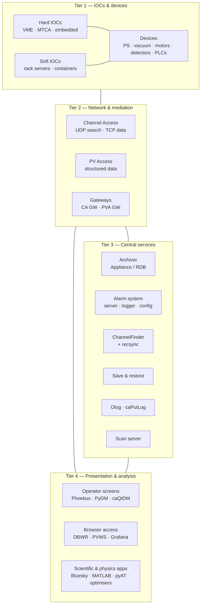

# Architecture

How the pieces relate. [Core Concepts](../start-here/core-concepts.md) told you what a record and a PV are; this section is about the shape of a whole system.

| Page | Covers |
| --- | --- |
| [Process Database](process-database.md) | Records, fields, links, scanning, lock sets, templates. The heart of EPICS. |
| [Protocols](protocols.md) | Channel Access and PV Access on the wire: search, connect, monitor, ports, tuning. |
| [Naming Conventions](naming-conventions.md) | Why a flat 60-character namespace forces you to design names deliberately. |
| [Networking](networking.md) | Broadcast domains, address lists, firewalls, VLANs, containers, MTU. |
| [Access Security](access-security.md) | Who may write to what, from where. |
| [Scaling & Availability](scaling-and-ha.md) | What actually breaks as you grow, and what redundancy is possible. |

## The four-tier model

Almost every EPICS facility, from a test stand to a light source, is this diagram at some scale.

### Tier 1: IOCs and devices

Where physics meets software. Every PV has exactly one owner here, and that owner is authoritative. IOCs are independent processes with no knowledge of each other beyond the PVs they read from one another.

Design pressure at this tier: **failure domains**. One IOC per device means a crashed IOC costs you one device. One IOC per subsystem means it costs you the subsystem. Nothing enforces a choice, so it becomes convention — and conventions that aren't written down decay. See [IOC inventory](../example-facility/ioc-inventory.md).

### Tier 2: Network and mediation

Channel Access and PV Access. No broker, no registry, no master: PV name resolution is by broadcast search, answered by whichever IOC owns the name.

This is the tier that surprises people. There is nothing in the middle of an EPICS system. That is why it survives partial failure so gracefully, and also why "which IOC serves this PV?" is a genuinely hard question requiring a [directory service](../toolbox/directory-services.md) to answer well.

[Gateways](../toolbox/gateways.md) are the only mediating processes, and they exist for two reasons: to reduce the number of TCP connections IOCs must serve, and to enforce a policy boundary (typically read-only) between network segments.

### Tier 3: Central services

Everything that needs to remember, notice, or coordinate. All of it is *just another CA/PVA client* — the archiver has no privileged access, no hook into the IOC. That uniformity is the design's best property: you can add, restart, or replace any service without touching a single IOC.

Services are also where the heavyweight infrastructure lives — Kafka, Elasticsearch, relational databases, Kubernetes. That's an inversion worth noticing: the tier nearest the beam has the fewest dependencies, and the tier furthest from it has the most.

### Tier 4: Presentation and analysis

Screens, browsers, notebooks, physics applications, optimisers. Tier 4 is where the largest number of humans meet the system and where per-facility divergence is greatest.

## Five properties that follow from this shape

**1. The PV name is the only interface.** Move an IOC to another host, change its device support from serial to Ethernet, replace the hardware entirely — as long as the PV names and semantics survive, nothing above Tier 1 notices. Conversely, renaming a PV breaks screens, archive continuity, alarm configuration, save sets, and scripts in a dozen places at once. **PV names are the facility's most expensive-to-change asset.** Treat the [naming convention](naming-conventions.md) accordingly.

**2. There's no transaction boundary.** No atomic multi-PV write, no rollback. "Set these four correctors simultaneously" is not a thing CA offers. When you need it, you push the coordination *down* into an IOC (one record triggering four outputs), or *up* into a sequencer, or you use hardware. Designing around this is normal EPICS practice, not a workaround.

**3. Time comes from the IOC.** Every value is timestamped where it was produced. Cross-IOC data correlation is therefore only as good as your clock distribution: NTP gets you milliseconds, PTP sub-microsecond, and an [event system](../toolbox/timing-systems.md) gets you beam-synchronous timestamps that actually let you correlate a BPM reading with the shot that produced it.

**4. Monitors are best-effort, not a log.** A CA monitor delivers *the current value at delivery time*. A slow client, a full queue, or a burst of updates means intermediate values are dropped — legitimately, by design. If you need every value, you need circular-buffer acquisition in the IOC, waveform records, or the archiver's own subscription. Never assume monitors reconstruct a complete history.

**5. Every layer is optional except Tier 1 and 2.** You can run a facility with IOCs and `caget` and nothing else. Each service earns its place by solving a problem you actually have — which is why [The Toolbox](../toolbox/index.md) is a catalogue rather than a stack.

## Where the boundaries are drawn

Two lines matter more than the tiers:

**The safety line.** [Machine and personnel protection](../example-facility/machine-protection.md) sit *outside* this diagram, in certified PLCs and hard-wired logic. They appear inside EPICS only as read-only status. This boundary is not negotiable, and blurring it is the most serious mistake in this problem domain.

**The determinism line.** Fast feedback — orbit feedback at kHz rates, LLRF loops, beam-based interlocks — lives in FPGAs and dedicated hardware. EPICS sets its parameters and reads its diagnostics, and stays out of the loop. Anything requiring guaranteed latency below roughly 10 ms should not depend on Channel Access.

## Next

→ [Process Database](process-database.md), the layer you'll spend most of your time in.
