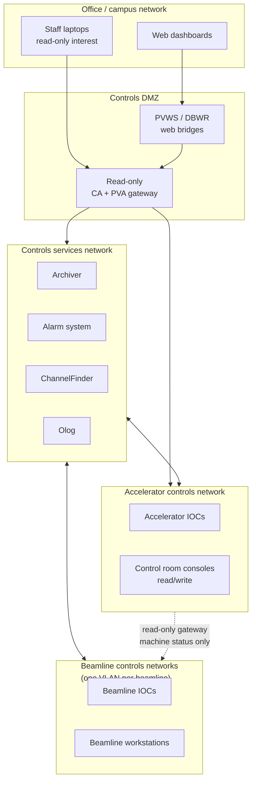

# Networking

EPICS discovers PVs by broadcast and carries data over TCP. Both halves of that sentence have operational consequences that catch out every newcomer, and a fair number of experienced people.

## The one rule: broadcasts don't route

A CA client with no configuration sends its name searches as **UDP broadcasts on every local interface**. Broadcasts stop at the router. So:

- Flat single-subnet lab network → everything works with zero configuration, which is why every tutorial omits this topic.
- Two subnets → clients on subnet A cannot find IOCs on subnet B, and the symptom is *"the PV doesn't exist"*, identical to a typo.

The fix is to tell clients where to look:

```bash
export EPICS_CA_AUTO_ADDR_LIST=NO
export EPICS_CA_ADDR_LIST="10.1.5.255 10.1.6.255 10.1.7.42"
#                          ↑ subnet broadcast   ↑ specific host or gateway
```

`EPICS_CA_ADDR_LIST` accepts subnet broadcast addresses, unicast host addresses, and `host:port`. Set `EPICS_CA_AUTO_ADDR_LIST=NO` alongside it, otherwise you get your deliberate list *plus* automatic local broadcasts, which makes behaviour depend on which interface a machine happens to have. PVA equivalents: `EPICS_PVA_ADDR_LIST`, `EPICS_PVA_AUTO_ADDR_LIST`.

At a real facility, nobody sets these per-user. They live in a site-wide profile script or an environment module, and the values differ per network zone. Getting that right centrally is a genuine piece of controls infrastructure work.

## Server-side configuration on multi-homed hosts

The variables above are client-side. IOC hosts with more than one interface — very common, since IOC servers often have a controls interface and a management interface — need the server side told what to do:

| Variable | Purpose |
| --- | --- |
| `EPICS_CAS_INTF_ADDR_LIST` | Which interfaces the CA server listens on. Without it, an IOC may serve on the management network and not the controls network, or both. |
| `EPICS_CAS_BEACON_ADDR_LIST` | Where beacons go. Clients that don't receive beacons reconnect slowly after an IOC restart. |
| `EPICS_CAS_IGNORE_ADDR_LIST` | Addresses whose searches are ignored. |
| `EPICS_PVAS_INTF_ADDR_LIST`, `EPICS_PVAS_BEACON_ADDR_LIST` | PVA equivalents. |

Symptom of getting this wrong: an IOC that is reachable from some hosts and not others, with no pattern that makes sense until you look at which interface answered.

## Firewalls

The minimum an IOC host must permit:

```text
inbound  UDP  5064   ← CA name searches
inbound  TCP  5064   ← CA data connections
outbound UDP  5065   → CA beacons to clients
inbound  UDP  5076   ← PVA searches
inbound  TCP  5075   ← PVA data connections
```

And on client hosts, inbound UDP 5064 (search replies) and 5065 (beacons, to `caRepeater`).

!!! warning "TCP-only rules are the classic misconfiguration"
    A firewall permitting TCP 5064 but not UDP 5064 gives you a system where *nothing ever connects*, because the search phase fails before TCP is attempted. Nothing in the error message hints at UDP. If a host suddenly can't see any PVs after a security update, check this first.

`caRepeater` is a small process that starts automatically on client hosts and redistributes beacons to every CA client process on that host. It binds UDP 5065. If it can't bind (blocked, or another process there), clients still work but reconnect slowly after IOC restarts.

## Segmentation: how facilities actually build this

Nobody puts IOCs on the office network. The standard pattern is layered zones with controlled crossings:



The reasoning behind each boundary:

**Office → DMZ is read-only, always.** [Access security](access-security.md) can't authenticate anyone, so the only trustworthy write control is topological. A read-only [gateway](../toolbox/gateways.md) is a hard boundary regardless of what a client claims about its identity.

**One VLAN per beamline.** Beamlines are independent experiments with independent users, independent schedules, and sometimes visiting equipment of unknown provenance. A broadcast storm or a misbehaving device on beamline 7 must not affect beamline 8. This also keeps each beamline's broadcast domain small enough that discovery stays cheap.

**Accelerator → beamline is one-way and narrow.** Beamlines need machine status: beam current, energy, shutter permits, top-up state. They do not need write access to the storage ring, and the accelerator does not need to see 20 beamlines' worth of detector traffic. A read-only gateway exporting a curated prefix list is the whole interface.

**Services sit in the middle** because they must reach everything and be reachable by everything, while hosting the only components with heavyweight dependencies (databases, Kafka, Elasticsearch).

Worked out concretely, with addresses and gateway rules: [Helios network design](../example-facility/network-design.md).

## Gateways in practice

Two jobs, both important:

**1. Connection multiplication control.** An IOC serving 400 workstations holds 400 TCP connections and pushes 400 copies of every monitor update. Behind a gateway it holds *one*, and the gateway fans out. At facility scale this is not an optimisation, it's the difference between working and not.

**2. Policy enforcement.** Gateway rule files allow, deny, or make read-only by PV-name pattern — which is why your [naming convention](naming-conventions.md) determines how expressible your policy is.

Options and configuration: [Gateways](../toolbox/gateways.md).

## Traffic characteristics and sizing

What actually flows on a controls network:

| Traffic | Character | Notes |
| --- | --- | --- |
| Name searches | UDP bursts, bursty at client startup | A workstation opening a large screen can emit thousands of searches in a second. Base rate-limits, but the startup burst is real. |
| Monitor updates | Small TCP packets, steady, high count | The dominant flow. Thousands to millions of packets/second facility-wide. |
| Beacons | UDP, one per IOC per ~15 s | Negligible bandwidth, important function. |
| Array/image traffic | Large TCP transfers, bursty | A single 4 MP camera at 30 fps is ~250 Mbit/s of one flow. Two of them saturate a gigabit link. |

Consequences for design:

- Detector data belongs on its own network segment or its own interface. Putting a fast camera on the same VLAN as vacuum and magnet IOCs means image bursts add latency to everything else.
- Small-packet rate, not bandwidth, is what limits monitor traffic. A switch happily passing 10 Gbit/s of bulk transfer can struggle with millions of 100-byte packets per second.
- Jumbo frames help array traffic and need to be consistent end to end. A path MTU mismatch produces the memorable failure mode where small PVs work perfectly and large waveforms hang.

## Containers, VMs, and clouds

Container networking breaks EPICS discovery in specific, diagnosable ways.

| Setup | Behaviour |
| --- | --- |
| Docker default bridge | NAT. Outbound searches work; **inbound searches and beacons do not reach the container**. An IOC in a default-bridge container is effectively invisible. |
| `--network host` | Works exactly like a process on the host. The usual answer for IOC containers. |
| Kubernetes with `hostNetwork: true` | Same. This is what [epics-containers](../toolbox/deployment-and-operations.md#epics-containers) does for IOC pods. |
| Kubernetes with pod networking | Needs explicit address lists both ways, and often a gateway per node. Fiddly but done in production. |
| VPN'd laptop | The VPN interface usually isn't the one broadcasts go out of. Set `EPICS_CA_ADDR_LIST` to specific gateway addresses. |
| Cloud VPCs | Broadcast is typically not supported at all. Unicast address lists only. |

For a client *inside* a container talking to IOCs outside, unicast address lists work fine. For a *server* inside a container, use host networking unless you have a specific reason not to.

## Diagnosing it

```bash
# What does the client actually see for one channel?
cainfo SR-C05-PS-QF-01:Current-RB     # server address, native type, access rights
pvinfo SR-C05-PS-QF-01:Current-RB     # PVA equivalent

# Which PVA servers exist on my segment?
pvlist                                # no CA equivalent — CA has no enumeration

# Is the IOC listening where I think?
ss -lunp | grep -E '5064|5076'        # UDP
ss -ltnp | grep -E '5064|5075'        # TCP

# Are searches leaving, and are replies coming back?
sudo tcpdump -n -i any 'udp port 5064 or udp port 5076'

# Who is connected to this IOC, and how much are they asking for?
# (on the IOC console)
epics> casr 1
epics> casr 2      # per-client detail: channel counts, queue state
```

`casr` at level 2 is the tool for "which client is hammering my IOC" — it shows per-client channel counts and event queue state, and the offender is usually obvious.

## Checklist for a new network segment

- [ ] Decide the zone and its trust level before assigning addresses
- [ ] Firewall: UDP **and** TCP, both directions, all four ports
- [ ] Site profile script sets `EPICS_CA_ADDR_LIST` / `EPICS_PVA_ADDR_LIST` for this zone
- [ ] Multi-homed IOC hosts have `EPICS_CAS_INTF_ADDR_LIST` set explicitly
- [ ] Gateway configured if the segment must be reachable from another zone, with a rule file under version control
- [ ] Gateway is read-only unless there is a written reason otherwise
- [ ] Time synchronisation (NTP at minimum, PTP if you care about sub-millisecond) — [timestamps come from IOCs](../toolbox/timing-systems.md), so unsynchronised clocks corrupt your archive
- [ ] Switch monitoring in place for packet rate, not just bandwidth
- [ ] Documented in the facility network diagram, with the EPICS zone boundaries marked

## Next

→ [Access Security](access-security.md) — what EPICS itself can enforce, and what it can't.
