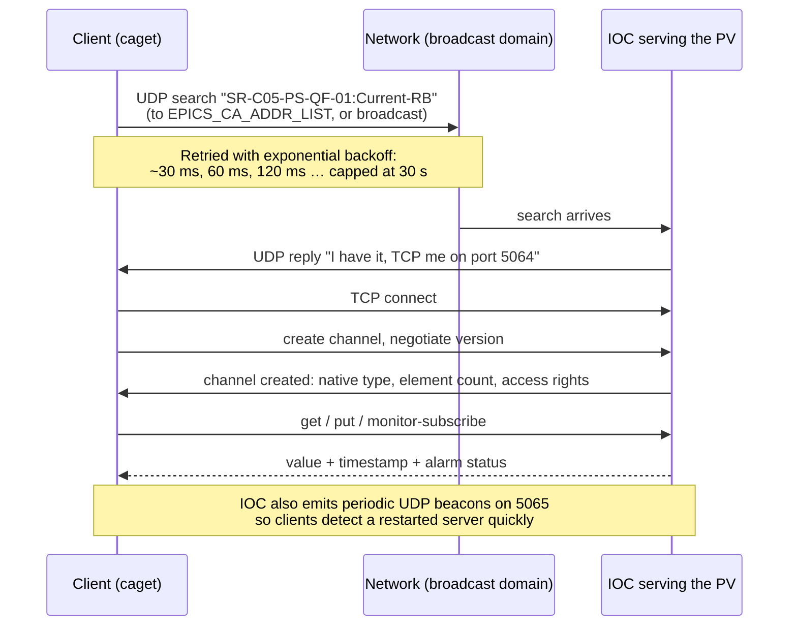

# Protocols: Channel Access and PV Access

EPICS has two network protocols. Both are current, both are supported, and an EPICS 7 IOC serves both simultaneously from the same records.

References: [Channel Access Reference Manual](https://epics.anl.gov/base/R3-14/8-docs/CAref.html) · [PV Access protocol specification](https://docs.epics-controls.org/en/latest/pv-access/protocol.html) · [Normative Types](https://docs.epics-controls.org/en/latest/pv-access/Normative-Types-Specification.html)

## Side by side

| | **Channel Access (CA)** | **PV Access (PVA)** |
| --- | --- | --- |
| Since | ~1990 | EPICS 7 (2017); designed as EPICS v4 |
| Data model | Scalars, arrays, and fixed compound "DBR" types (value + timestamp + limits + …) | Arbitrary nested structures, introspected at runtime |
| Standard structures | — | [Normative Types](https://docs.epics-controls.org/en/latest/pv-access/Normative-Types-Specification.html): `NTScalar`, `NTNDArray`, `NTTable`, `NTEnum`, … |
| Partial access | No — you get the whole channel | Yes — request a sub-field of a structure |
| RPC | No | Yes (`pvcall`) — services with typed arguments and returns |
| Discovery | UDP broadcast/unicast, port 5064 | UDP broadcast/unicast, port 5076 |
| Data transport | TCP, port 5064 | TCP, port 5075 |
| Beacons | UDP 5065 | UDP 5076 (multicast-capable) |
| C library | `libca` in Base | [PVXS](../toolbox/client-libraries.md#pvxs) (modern) or pvAccessCPP (older) |
| CLI tools | `caget`, `caput`, `camonitor`, `cainfo`, `cainfo` | `pvget`, `pvput`, `pvmonitor`, `pvinfo`, `pvcall`, `pvlist` |
| Base server | Every IOC; `softIoc` | Every Base 7 IOC with `pvAccess`; `softIocPVA` |
| Share of production traffic | Overwhelming majority | Growing; dominant in new services and imaging |

### Which should you use?

**Learn with CA.** Its tooling, examples, and mailing-list history are vastly larger, and it is what your facility's existing screens use.

**Reach for PVA when you need**: a structure (value plus metadata as one atomic unit), a table, an image with its dimensions and attributes attached ([`NTNDArray`](../toolbox/detectors-and-imaging.md)), an RPC-style service call, partial reads of a large structure, or a service that only speaks PVA.

This is not an either/or migration. Facilities run both, indefinitely.

## How a connection is made

Understanding this sequence explains most connectivity failures.



Failure modes that map directly onto this diagram:

| Symptom | Where it broke |
| --- | --- |
| "Channel connect timed out" | The search never reached an IOC, or the reply never came back. Address list, routing, or firewall. |
| Connects then immediately disconnects | TCP reachable but something (NAT, asymmetric routing, MTU) breaks the data connection. |
| Works from host A, not host B | Different broadcast domain or different `EPICS_CA_ADDR_LIST`. |
| Slow to reconnect after an IOC restart | Beacons blocked (UDP 5065), so the client waits for its own retry backoff instead of being told. |
| Two clients see different values for one name | Duplicate PV name on two IOCs. See [naming](naming-conventions.md). |

## Monitors: the part people misunderstand

A **monitor** is a subscription: "tell me when this changes". It is the mechanism behind every live screen and the archiver.

What "changes" means is set by the record, not the client:

- `MDEL` on the record — the monitor deadband. Change smaller than this posts nothing.
- The monitor's event mask — value changes, alarm changes, archive events, or property changes.

!!! warning "Monitors are not a complete history"
    Monitors deliver *the current value at delivery time*. If a client is slow, or its queue fills, or values change faster than the network drains, **intermediate values are dropped by design**. Base logs "client last message" / queue-overflow warnings when this happens.

    If you need every sample: buffer it in the IOC (`compress` record, circular buffer in the driver, waveform per acquisition), or use a mechanism designed for it. Do not build a data pipeline that assumes monitors are lossless — this mistake is usually discovered months later, in analysis.

**Cost model.** Network and CPU load ≈ (number of monitored channels) × (update rate) × (number of subscribed clients). Four hundred workstations each monitoring 5 000 PVs at 10 Hz is 20 million updates per second demanded of your IOCs. This is what [gateways](../toolbox/gateways.md) exist to collapse: the gateway holds one monitor per PV and fans out to its clients, so an IOC serves one connection instead of four hundred.

## Data types

### Channel Access DBR types

CA offers each channel in several *request types*, layered:

```text
DBR_DOUBLE            value only
DBR_STS_DOUBLE        + status, severity
DBR_TIME_DOUBLE       + timestamp        ← what monitors normally use
DBR_GR_DOUBLE         + display limits, units, precision
DBR_CTRL_DOUBLE       + control limits
```

Plus `DBR_ENUM` for enumerated values (with up to sixteen 26-character state strings) and `DBR_STRING`, which is **40 characters, hard limit**. Longer text needs a `char` waveform (the `-S` option in `caget`) or the `lsi`/`lso` long-string record types.

`caget` gives you value only; `caget -a` adds timestamp and alarm; `caget -d DBR_CTRL_DOUBLE` gives you everything. When a display shows units and limits without you configuring them, that's `DBR_CTRL` at work.

### PV Access structures

PVA transports self-describing structures. An `NTScalar` is:

```text
structure NTScalar
    double value
    alarm_t alarm
        int severity
        int status
        string message
    time_t timeStamp
        long secondsPastEpoch
        int nanoseconds
        int userTag
    display_t display
        double limitLow
        double limitHigh
        string description
        string units
        int precision
    control_t control
        ...
```

Two properties this buys you:

1. **Atomicity.** Value, timestamp, alarm and metadata arrive as one object. With CA, a value and its associated status are separate requests that can interleave.
2. **Partial requests.** `pvget -r 'value,timeStamp' BIG:PV` transfers only those fields — significant when the structure is a megapixel image or a 10 000-row table.

`NTNDArray` is why detector work has moved to PVA: an image, its dimensions, its compression codec, its unique ID and its per-frame attributes are one coherent object, which is exactly what a downstream analysis pipeline needs.

## Ports and firewalls

| Port | Protocol | Direction | Purpose |
| --- | --- | --- | --- |
| 5064/udp | CA | client → server (broadcast or unicast) | Name search |
| 5064/tcp | CA | client → server | Channel data |
| 5065/udp | CA | server → clients (broadcast) | Beacons |
| 5075/tcp | PVA | client → server | Channel data |
| 5076/udp | PVA | both | Search and beacons (multicast capable) |

Firewall rules must permit **inbound UDP** on 5064/5076 to IOCs, **inbound TCP** on 5064/5075 to IOCs, and the beacon path back to clients. A common misconfiguration allows TCP but not UDP, which produces "the PV doesn't exist" with no other symptom.

Repeaters: CA uses a local **`caRepeater`** process that fans beacons out to multiple client processes on one host. It starts automatically, listens on UDP 5065, and its absence causes slow reconnection. If you see complaints about `caRepeater` in a log, that's what it is.

## Configuration that matters

Full list in [environment variables](../reference/environment-variables.md). The ones with real consequences:

| Variable | Default | Why you'd change it |
| --- | --- | --- |
| `EPICS_CA_ADDR_LIST` | (empty) | The list of addresses to send searches to. **Set this explicitly on any routed network.** Broadcast addresses of remote subnets, or IOC/gateway unicast addresses. |
| `EPICS_CA_AUTO_ADDR_LIST` | `YES` | `NO` to stop also broadcasting on every local interface — required when your list is deliberate. |
| `EPICS_CA_MAX_ARRAY_BYTES` | 16384 (Base < 3.14.12 era default; modern Base auto-sizes) | Historic source of "array truncated" grief. Modern Base grows buffers dynamically, but old clients and old IOCs still need it raised on both ends. |
| `EPICS_CA_CONN_TMO` | 30 s | How long before a quiet connection is declared dead. |
| `EPICS_CA_BEACON_PERIOD` | 15 s | Server beacon interval. |
| `EPICS_CA_SERVER_PORT` / `EPICS_CA_REPEATER_PORT` | 5064 / 5065 | Run two isolated EPICS "universes" on one network by changing the port. A legitimate trick for a test system beside a production one — and a way to make PVs mysteriously invisible if you forget you did it. |
| `EPICS_PVA_ADDR_LIST`, `EPICS_PVA_AUTO_ADDR_LIST`, `EPICS_PVA_SERVER_PORT`, `EPICS_PVA_BROADCAST_PORT` | — | PVA equivalents. |
| `EPICS_CAS_INTF_ADDR_LIST` / `EPICS_CAS_BEACON_ADDR_LIST` | — | *Server-side*: which interfaces to serve on and where to send beacons. Essential on multi-homed IOC hosts, where the default behaviour is often wrong. |

!!! tip "Array sizes are still a real trap"
    Large waveforms (camera images, orbit arrays) fail in ways that look like corruption rather than a limit. If a 2 048-element waveform reads back with 1 024 elements, or `caget` reports a size mismatch, suspect buffer limits on the client, the server, *and* any [gateway](../toolbox/gateways.md) in between — all three have to agree.

## Security posture, stated plainly

**Channel Access has no authentication and no encryption.** The "user name" a client sends is whatever it chooses to send. [Access security](access-security.md) rules based on it are a guard against accident, not against an adversary. Anyone with IP reachability to an IOC can, in general, write to any PV that isn't protected by an ASG, and even ASGs trust a self-declared identity.

The architectural answer is network segmentation — controls networks are physically or logically separated, and everything else reaches them through a read-only [gateway](../toolbox/gateways.md). See [Networking](networking.md) and the [example facility's network design](../example-facility/network-design.md).

Work on authenticated, TLS-protected PVA (often discussed as "secure PVA") has been ongoing in the community; check the current Base and PVXS release notes rather than any statement on this page for where it stands.

## Next

→ [Naming Conventions](naming-conventions.md) — because the PV name is the entire API.
