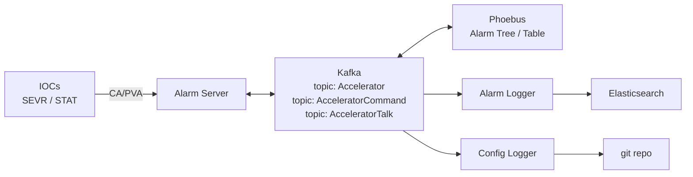

# Install the Phoebus Alarm System

Three services plus Kafka, giving you a real alarm system: latching, acknowledgement, hierarchy, delays, and history.

Overview and the reasoning behind the design: [Toolbox → Alarms](../toolbox/alarms.md).

| Component | Documentation |
| --- | --- |
| Alarm Server | [services/alarm-server](https://control-system-studio.readthedocs.io/en/latest/services/alarm-server/doc/index.html) |
| Alarm Logger | [services/alarm-logger](https://control-system-studio.readthedocs.io/en/latest/services/alarm-logger/doc/index.html) |
| Alarm Config Logger | [services/alarm-config-logger](https://control-system-studio.readthedocs.io/en/latest/services/alarm-config-logger/doc/index.html) |
| UI | [app/alarm](https://control-system-studio.readthedocs.io/en/latest/app/alarm/ui/doc/index.html) |

## Prerequisites

| Need | For |
| --- | --- |
| [JDK](jdk.md) | All three services |
| [Phoebus built](phoebus.md) | The service JARs come from that build |
| **Apache Kafka** | Configuration and state transport. Mandatory — the architecture is built on it. |
| **Elasticsearch** | Alarm Logger's history store (optional but strongly recommended) |
| A git repository | Alarm Config Logger's store (optional) |

!!! note "Kafka is the real work"
    The services themselves are `java -jar` plus a properties file. Standing up and operating Kafka — brokers, topics, retention, replication, monitoring — is where the effort goes. For a single-node learning setup it's a download and two commands; for a facility it's a proper piece of infrastructure with an owner.

## The shape of it



Each **alarm configuration** is a Kafka topic (conventionally named after the configuration, e.g. `Accelerator`), plus companion topics for commands and annunciation. A facility typically has several: `Accelerator`, `Beamlines`, `Utilities` — each with its own tree and its own alarm server instance.

## Kafka, minimally

Follow the [Kafka quickstart](https://kafka.apache.org/quickstart) for a single node. Then create the topics the alarm system needs — Phoebus's alarm server documentation lists the required topics and the **log-compaction settings**, which matter: the configuration topic must be compacted so the current state is retained indefinitely rather than aged out.

Getting the topic configuration wrong produces an alarm system that works, then loses its configuration days later when retention expires. Read that section of the upstream docs carefully.

## Run the alarm server

```bash
cd ~/phoebus/services/alarm-server/target
java -jar alarm-server-*.jar -config Accelerator -settings alarm_settings.ini
```

`alarm_settings.ini`:

```properties
org.phoebus.applications.alarm/server=localhost:9092
org.phoebus.applications.alarm/config_names=Accelerator
org.phoebus.pv.ca/addr_list=10.1.5.255
```

Import an initial configuration from XML:

```bash
java -jar alarm-server-*.jar -config Accelerator -import config.xml -settings alarm_settings.ini
```

The XML is a tree of components and PVs, with per-alarm latching, annunciation, delay, count, guidance, displays, and automated actions:

```xml
<config name="Accelerator">
  <component name="Storage Ring">
    <component name="Vacuum">
      <pv name="SR-C05-VA-IP-03:Pressure">
        <description>Cell 5 ion pump 3 pressure</description>
        <latching>true</latching>
        <annunciating>true</annunciating>
        <delay>5</delay>
        <guidance>
          <title>What to do</title>
          <details>Check the pump controller and the neighbouring gauges.
Pressure rise across a whole cell suggests a leak; a single gauge
suggests the gauge. Call the vacuum on-call if above 1e-7.</details>
        </guidance>
        <display>
          <title>Cell 5 vacuum</title>
          <details>/opt/displays/sr/vacuum_cell.bob?CELL=05</details>
        </display>
      </pv>
    </component>
  </component>
</config>
```

**The `<guidance>` and `<display>` elements are the point of the exercise.** An alarm that tells an operator what it means and opens the right screen is useful at 03:00; a red rectangle is not. Filling these in is the majority of the real work of deploying an alarm system, and it's the part that gets skipped.

## Run the loggers

```bash
# Alarm history into Elasticsearch
java -jar alarm-logger-*.jar -properties logger.properties

# Configuration changes into git
java -jar alarm-config-logger-*.jar -properties config_logger.properties
```

Both need the Kafka address and their respective backends configured.

## Connect Phoebus

In your Phoebus `settings.ini`:

```properties
org.phoebus.applications.alarm/server=kafka.example.org:9092
org.phoebus.applications.alarm/config_names=Accelerator,Beamlines
org.phoebus.applications.alarm.logging.ui/service_uri=http://alarmlogger.example.org:9000
```

Then Applications → Alarm → Alarm Tree.

## Verify it end to end

Using the demo IOC from [Your First IOC](first-ioc.md):

1. Add `DEMO:Temperature` to the configuration with `HIHI` already set on the record.
2. `caput DEMO:Heater-SP 100` and wait — the temperature passes 75.
3. The alarm appears in the Alarm Tree, propagating severity up to the root.
4. Acknowledge it. The state changes but the alarm remains listed.
5. `caput DEMO:Heater-SP 0`. The temperature falls; with latching enabled the alarm **stays visible until acknowledged**. That's the feature — verify it, because it's what distinguishes an alarm system from a colour-changing widget.
6. Check the alarm logger recorded both the transition and your acknowledgement.
7. Restart the alarm server. It rebuilds state from Kafka in seconds and nothing is lost.

Step 7 is worth doing deliberately: it's the property that makes this architecture worth its Kafka dependency.

## Operating it

**Monitor the pipeline**: alarm server alive, Kafka broker health, consumer lag, Elasticsearch health. And alarm on **alarm rate going to zero** — a silent alarm system looks exactly like a quiet machine.

**Review the alarm log monthly.** Rank by frequency; the top ten are your problem list. This one practice improves alarm quality more than any amount of configuration.

**Keep the configuration in version control** as XML, and import it, rather than treating the live Kafka topic as the master. The config logger's git repository gives you history either way, but a reviewable source file is what lets you *change* it safely.

**Give control-system health its own branch.** [iocStats](../toolbox/soft-support-modules.md#iocstats--deviocstats) heartbeats belong in the alarm tree, under a distinct subtree, so the controls team's problems don't interleave with the machine's. See [Observability](../toolbox/observability.md).

## Simpler alternatives

**No alarm system at all**: record-level limits displayed with alarm colouring on a [Phoebus](phoebus.md) screen. Genuinely adequate for a test stand — you get severity, colour, and `camonitor` visibility with zero infrastructure. What you don't get is latching, acknowledgement, hierarchy, or history.

**BEAST**, the older RDB-backed alarm system, is still in service at some facilities and needs no Kafka. Migration tooling to the Phoebus system exists. Don't start here for new work.

## Next

→ [ChannelFinder & recsync](channelfinder-recsync.md)
