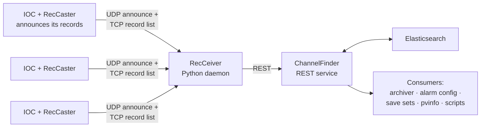

# Install ChannelFinder and recsync

Two pieces that together answer "which IOC serves this PV, and what else is like it?" — automatically, with no list for anyone to maintain.

Overview: [Toolbox → Directory Services](../toolbox/directory-services.md).

| Component | Source |
| --- | --- |
| ChannelFinder service | [github.com/ChannelFinder/ChannelFinderService](https://github.com/ChannelFinder/ChannelFinderService) |
| Home / docs | [channelfinder.github.io](https://channelfinder.github.io/) |
| recsync (RecCaster + RecCeiver) | [github.com/ChannelFinder/recsync](https://github.com/ChannelFinder/recsync) |
| Java client | [github.com/ChannelFinder/javaCFClient](https://github.com/ChannelFinder/javaCFClient) |
| Python client | [github.com/ChannelFinder/pyCFClient](https://github.com/ChannelFinder/pyCFClient) |
| Web UI | [pvinfo](pvinfo.md) |

## Architecture



The important property: **the directory is generated from running IOCs.** Add a record, restart the IOC, and it's in ChannelFinder with its IOC name, host and record type. Delete it and it disappears. Nobody maintains a spreadsheet, and nobody can forget to.

## 1. Elasticsearch

ChannelFinder stores its data in Elasticsearch. **Check ChannelFinder's README for the supported major version** — this has changed and a mismatch produces obscure failures.

Single-node, for learning:

```bash
docker run -d --name es -p 9200:9200 \
  -e discovery.type=single-node \
  -e xpack.security.enabled=false \
  docker.elastic.co/elasticsearch/elasticsearch:<supported-version>
```

```bash
curl http://localhost:9200        # should return cluster info
```

For production: a three-node cluster, security enabled, backed up. Note that [Olog](olog.md) and the [alarm logger](alarm-system.md) also want Elasticsearch, so one properly-run cluster serving all three is usually the right facility decision.

## 2. ChannelFinder service

A Spring Boot application:

```bash
git clone https://github.com/ChannelFinder/ChannelFinderService.git
cd ChannelFinderService
mvn clean install
java -jar target/ChannelFinder-*.jar
```

Configuration is `application.properties` — Elasticsearch host, port, authentication, and the service's own auth (LDAP or a demo in-memory user store). Check it responds:

```bash
curl http://localhost:8080/ChannelFinder
```

Releases and container images are also published, which is usually less work than building.

## 3. RecCeiver

The daemon that listens for IOC announcements and populates ChannelFinder. Python, from the [recsync](https://github.com/ChannelFinder/recsync) repository's `server/` directory.

```bash
git clone https://github.com/ChannelFinder/recsync.git
cd recsync/server
pip install .
```

Configured by a `.conf` file specifying the ChannelFinder URL, credentials, and which properties to attach to every channel it registers. Run it under systemd; it needs to be up whenever IOCs start, since a missed announcement means those PVs are absent from the directory until the next IOC restart.

## 4. RecCaster in every IOC

The EPICS module side, from the same repository's `client/` directory. Build it like any support module, add it to your IOC's `configure/RELEASE`, and load it:

```text
# in st.cmd, before iocInit
dbLoadRecords("$(RECSYNC)/db/reccaster.db", "P=SR-C05-VA-IOC-01:")
```

That's it — no per-record work. RecCaster uploads the complete record list at startup.

### Attaching your own metadata

The valuable part. `info()` tags in the database are forwarded as ChannelFinder properties:

```text
record(ai, "SR-C05-VA-IP-03:Pressure") {
    field(DESC, "Cell 5 ion pump 3")
    info(recceiver:subsystem, "vacuum")
    info(recceiver:area,      "SR-C05")
    info(recceiver:archive,   "monitor")
    info(recceiver:critical,  "yes")
}
```

Now the archiver can be configured by query ("archive everything with `archive=monitor`"), the alarm configuration can be generated from `critical=yes`, and a save set can be "all setpoints in subsystem `magnets`".

Declaring metadata **where the record is defined** is the whole trick: it's version-controlled with the record, reviewed with it, and correct by construction. Metadata added later through the REST API drifts from reality within months.

## Query it

```bash
# Everything on one IOC
curl 'http://localhost:8080/ChannelFinder/resources/channels?iocName=SR-C05-VA-IOC-01'

# By name pattern
curl 'http://localhost:8080/ChannelFinder/resources/channels?~name=SR-*-DI-BPM-*:X-Mon'

# By your own property
curl 'http://localhost:8080/ChannelFinder/resources/channels?subsystem=vacuum'

# Duplicate detection: names appearing from more than one IOC
# (query all, group by name, look for count > 1 — worth a scheduled CI job)
```

## Define your property vocabulary first

Before registering anything, agree the property names and write them down next to the [naming convention](../architecture/naming-conventions.md):

| Property | Values |
| --- | --- |
| `subsystem` | `vacuum`, `magnets`, `rf`, `diagnostics`, `timing`, `insertion-devices`, … |
| `area` | Matches the area codes in your PV names |
| `deviceType` | `bpm`, `ion-pump`, `power-supply`, … |
| `archive` | `monitor`, `scan-1hz`, `none` |
| `critical` | `yes`, `no` |
| `beamline` | For beamline PVs |

Ad-hoc properties accumulate into an unqueryable mess — `system`, `subsystem`, `sys` and `Subsystem` all coexisting is the predictable outcome of not deciding.

## Verify

1. Start Elasticsearch, ChannelFinder, RecCeiver.
2. Start an IOC with RecCaster loaded.
3. Query for that IOC's name — its records should be listed within seconds.
4. Stop the IOC. The channels should be marked inactive (`pvStatus=Inactive`) rather than deleted, which is the correct behaviour — history matters.
5. Add a record, restart, query again.

## Then use it

The directory earns its keep through its consumers:

- [Archiver Appliance](archiver-appliance.md) — configure archiving by ChannelFinder query
- [Save & restore](save-and-restore.md) — define configurations by query
- [PV Info](pvinfo.md) — the human web front end
- [Phoebus](phoebus.md) — Channel Table application
- Physics and operations scripts — query instead of hard-coding PV lists

## Next

→ [Save & Restore](save-and-restore.md)
