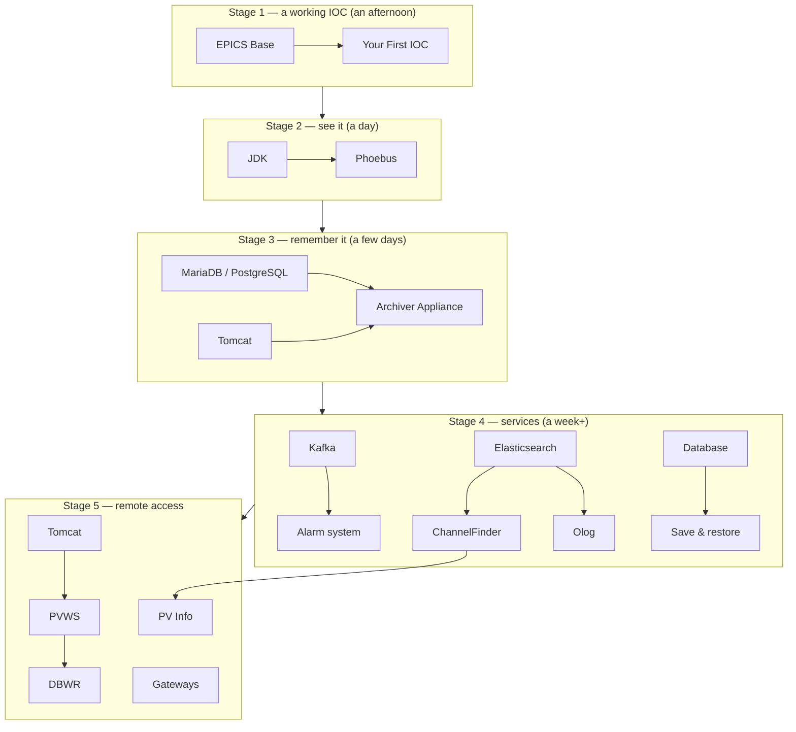

# Build and Install

Practical how-tos. These are deliberately thin — upstream maintains the authoritative instructions, and duplicating them here would guarantee they go stale. What these pages add is **order, context, and the things that go wrong**.

!!! note "Platform assumption"
    Linux throughout. Debian 12 and Ubuntu LTS are what the commands were written against; RHEL-family equivalents are noted where they differ. See [Linux Prerequisites](../start-here/linux-prerequisites.md) first.

## Order of installation

Not everything, and not all at once. Each stage is useful on its own.

## The pages

### Stage 1 — a working IOC

| Page | Time | Gets you |
| --- | --- | --- |
| [EPICS Base](epics-base.md) | ~30 min | `softIoc`, `caget`, `caput`, the build system |
| [Your First IOC](first-ioc.md) | ~30 min | Records you own, changing on demand |

**Stop here and play for a while.** Everything else is easier once PVs feel ordinary.

### Stage 2 — see it

| Page | Gets you |
| --- | --- |
| [Java (JDK)](jdk.md) | The prerequisite for every Java tool below |
| [Phoebus](phoebus.md) | Displays, trends, PV tables, and the client for every service in stage 4 |

Python alternative: `pip install pydm` gives you [PyDM](../toolbox/operator-interfaces.md#pydm) with no JDK at all. Legitimate, and much faster to a first screen.

### Stage 3 — remember it

| Page | Gets you |
| --- | --- |
| [Archiver Appliance](archiver-appliance.md) | Facility-scale history. Needs Tomcat + a database. |

Easier alternative for a first archiver: the [Phoebus RDB archive engine](../toolbox/archiving.md#phoebus-rdb-archive-engine), which you already built with Phoebus and which needs only a database.

### Stage 4 — the services

| Page | Needs | Gets you |
| --- | --- | --- |
| [Alarm System](alarm-system.md) | Kafka, Elasticsearch | Alarm server, logger, config logger |
| [ChannelFinder & recsync](channelfinder-recsync.md) | Elasticsearch | Know which IOC serves what |
| [Save & Restore](save-and-restore.md) | A database | Named configurations and snapshot diffs |
| [Olog](olog.md) | Elasticsearch, MongoDB | Electronic logbook |

All four are built from the Phoebus source tree you already have. The work is in their infrastructure dependencies, not in the services.

### Stage 5 — remote and web access

| Page | Gets you |
| --- | --- |
| [Tomcat](tomcat.md) | The servlet container for the WAR-file services |
| [PVWS](pvws.md) | WebSocket bridge — PVs in a browser |
| [DBWR](dbwr.md) | Your Phoebus displays, rendered in a browser |
| [PV Info](pvinfo.md) | Web front end to ChannelFinder |
| [Gateways](gateways.md) | Safe read-only export across a network boundary |

### Alternative to all of the above

| Page | Gets you |
| --- | --- |
| [Containers](containers.md) | The modern deployment path — prebuilt images, reproducible IOCs |

## Shortcuts, if you'd rather not compile

| Route | What you get | Cost |
| --- | --- | --- |
| **[Training VM](../reference/training.md)** | The complete stack, running, in VirtualBox | You learn nothing about assembly — which is fine if your goal is to learn EPICS rather than to build it |
| **conda** | `conda install -c conda-forge epics-base` | Base only |
| **apt** | `apt install epics-dev` ([epicsdeb](../toolbox/deployment-and-operations.md#distribution-packages)) | Base and some modules, possibly older |
| **[epics-containers](containers.md)** | Prebuilt IOC images | Container tooling to learn instead |

!!! tip "Build Base by hand at least once"
    You'll spend the rest of your EPICS career interacting with that build system — `configure/RELEASE`, `EPICS_HOST_ARCH`, architecture-specific output directories. Thirty minutes now saves considerable confusion later. After that, use packages freely.

## Realistic time budget

| Milestone | Effort |
| --- | --- |
| Base built, `softIoc` running | An afternoon |
| Your own IOC with real records | +1 day |
| A screen showing your PVs | +1 day |
| Talking to real hardware | +2–5 days, mostly protocol details |
| Archiving | +2–3 days including the database |
| The full service suite | +1–2 weeks, mostly infrastructure |
| Confident in all of it | Months. That's normal. |

## Before you start

- [ ] A Linux VM or container you're willing to break
- [ ] `build-essential`, `perl`, `git`, `libreadline-dev` — see [prerequisites](../start-here/linux-prerequisites.md)
- [ ] Familiarity with [core concepts](../start-here/core-concepts.md), so the words mean something
- [ ] An hour without interruptions

## Next

→ [EPICS Base](epics-base.md)
