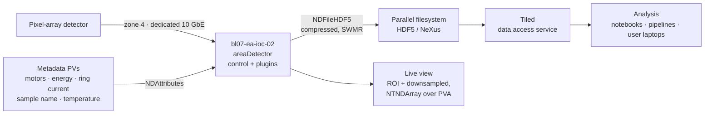

# A Beamline: BL07

One beamline in full. **BL07 — Hard X-ray Microfocus**, on an in-vacuum undulator in straight 7.

Everything in the accelerator chapters happens at facility scale with an operations team. A beamline is different: a handful of staff, a new experiment every week, and users who arrive on Monday and leave on Friday. That changes the control system's priorities.

## What it is

| Parameter | Value |
| --- | --- |
| Source | In-vacuum undulator, 18 mm period, straight 7 |
| Energy range | 5–25 keV |
| Monochromator | Si(111) double crystal, LN₂ cooled |
| Focusing | Kirkpatrick–Baez mirror pair |
| Focal spot | 1 × 1 µm |
| Flux at focus | ~10¹² ph/s at 12 keV |
| Techniques | Microdiffraction, XRF mapping, XANES |
| Detectors | Pixel-array area detector; 4-element fluorescence detector |
| End station | 6-axis sample stage + goniometer |

## Its five IOCs

| IOC | Owns |
| --- | --- |
| `bl07-op-ioc-01` | Monochromator, KB mirrors, slits — [motor](../toolbox/motion.md) + pseudo-motors |
| `bl07-op-ioc-02` | Beamline vacuum, cooling, filters, attenuators, beam-position monitors |
| `bl07-ea-ioc-01` | Sample stages, goniometer, alignment cameras |
| `bl07-ea-ioc-02` | Area detector — [areaDetector](../toolbox/detectors-and-imaging.md) |
| `bl07-ea-ioc-03` | Sample environment: cryostream, gas rig, temperature |

Plus, outside the beamline's ownership: `fe-bl07-ioc-01` (the front end, an *accelerator* IOC) and the [PPS interface](machine-protection.md) that governs its shutters.

≈6 500 PVs. The detector IOC alone contributes about 3 000, because areaDetector's plugin chain is PV-rich.

## Pseudo-motors: the interesting part

Physicists want energy, gap, centre and focus. Motors want positions. Every beamline is mostly this translation.

### Monochromator energy

```text
BL07-OP-DCM-01:Energy-SP     ← what the user sets, in keV
BL07-OP-DCM-01:Bragg-RB      ← the actual crystal angle
BL07-OP-DCM-01:Perp-RB       ← second-crystal translation, keeping the beam offset fixed
```

Energy → Bragg angle via `λ = 2d·sin(θ)`, plus a coordinated perpendicular translation so the outgoing beam stays at a fixed height. Implemented in the IOC — `calc`/`transform` records driving two [motor](../toolbox/motion.md) records — because the relationship must hold whoever is asking and whatever is running.

### Slits

```text
BL07-OP-SLIT-01:Gap-SP  BL07-OP-SLIT-01:Centre-SP
        ↓                        ↓
BL07-OP-SLIT-01:Blade1  BL07-OP-SLIT-01:Blade2
```

`gap = x2 - x1`, `centre = (x1 + x2)/2`. The transformation is trivial; the **limit handling is not**. A legal gap-and-centre combination can require an illegal blade position, and getting that wrong drives blades into each other. Slit implementations spend most of their code on limits, which is the general lesson about coordinated motion.

### Undulator gap tracking

```text
BL07-OP-DCM-01:Energy-SP  →  SR-S07-ID-U18-01:Gap-SP
```

The undulator gap follows the monochromator energy through a calibration table.

**This lives in an IOC, not a script.** Implemented as a Python script on a beamline workstation, it stops when that workstation is rebooted mid-scan, and the user's data becomes quietly wrong — flux falls off the undulator harmonic while the scan continues reporting normal-looking numbers. It's the canonical example of [logic in the wrong layer](../toolbox/scanning-and-automation.md#guidance).

Note also that the gap PV belongs to the **accelerator** (`SR-S07-...`) while the energy PV belongs to the beamline (`BL07-...`). So the tracking IOC needs write access across the [zone 1 / zone 2 boundary](network-design.md) — one of the few legitimate cross-boundary write paths at HLS, and it is a specific documented exception with a named owner, not a relaxed gateway rule.

## The data path

Where the beamline's architecture diverges most sharply from the accelerator's.



Three decisions embedded there:

**1. The detector is on [zone 4](network-design.md), its own network.** At full frame rate this detector produces more than a gigabyte per second. Putting that on the VLAN carrying vacuum readings would add latency to control traffic for no benefit.

**2. Bulk data never crosses Channel Access.** The plugin chain writes HDF5 directly to the parallel filesystem. What EPICS serves to clients is a downsampled live view and the [statistics](../toolbox/detectors-and-imaging.md#analysis-plugins) — enough for an operator to see the beam is on the sample, not the science data.

**3. Metadata travels *with* the frames.** Motor positions, monochromator energy, ring current, sample name and temperature are attached via `NDAttributes` and land in the HDF5 file automatically.

That third one is the difference between a usable dataset and an archaeology project. Metadata reconstructed later from the archiver is lossy, error-prone, and sometimes impossible — and you discover which when a user asks about a two-year-old dataset. See [Scientific Data](../toolbox/scientific-data.md).

### Dropped frames

`NDFileHDF5`'s and each plugin's dropped-array counters are on the operator screen and in the [alarm tree](alarm-plan.md). A detector quietly dropping 2% of frames produces data that looks fine and isn't, and the counter is the only place that's visible.

## Experiment orchestration

| Layer | Used for |
| --- | --- |
| [Bluesky](../toolbox/scientific-data.md#bluesky) + ophyd, via queueserver | User experiments — scans, maps, adaptive measurements |
| [Phoebus scan server](../toolbox/scanning-and-automation.md#phoebus-scan-server) | Staff alignment and commissioning procedures |
| [sscan](../toolbox/scanning-and-automation.md#sscan) records | Fast inner loops where the IOC should own the scan |
| IOC records | Anything the beamline depends on continuously — gap tracking, feed-forward, interlocking summaries |

Bluesky runs under **queueserver**, not in a user's terminal, so a scan is a supervised, queued, visible service. A plan running in somebody's ssh session ends when their laptop sleeps, which is exactly the failure that costs a user their beam time.

Continuous ("fly") scanning for XRF maps uses hardware triggers: the controller executes a trajectory, emits position-based triggers, latches actual encoder position at each one, and the detector integrates between them. Correctness comes from hardware timing — a trigger derived from the encoder is trustworthy, and a timestamp applied by a script is not. See [trajectory scanning](../toolbox/motion.md#trajectory-and-continuous-scanning).

## What beamline staff need that operators don't

The priorities genuinely differ, and a control system designed only for the accelerator serves beamlines badly.

**Reconfiguration every week.** A new experiment arrives with new sample environment, sometimes new detectors, sometimes visiting equipment. So beamline IOCs must be quick to modify and redeploy — the [container + ibek](../toolbox/deployment-and-operations.md#ibek) workflow matters more here than anywhere else in the facility.

**[Save & restore](../toolbox/save-and-restore.md) used constantly.** "The configuration we ran the 2 keV XANES experiment with" is restored six months later when the same group returns. This is the beamline's most-used service by a wide margin, whereas the accelerator uses it a few times a shift.

**Their own workstations, with write access.** Beamline staff and users write to beamline PVs directly from zone 2 — no gateway, no control-room approval. Hence [one VLAN per beamline](network-design.md#one-vlan-per-beamline): a beamline is trusted within its own boundary and nowhere else.

**Machine status, not machine control.** About forty PVs from the accelerator: stored current, energy, machine mode, top-up state, shutter permits. Delivered read-only through GW-2/3.

**Data first.** The accelerator's product is beam; a beamline's product is data. Which means the file writer, the metadata, the filesystem and the [data access service](../toolbox/scientific-data.md#tiled) are first-class control system concerns here, not peripheral ones.

## Where the PPS boundary shows

A user in the experimental hutch wants beam. The sequence:

1. Search and secure the hutch — a physical procedure with the **PPS**.
2. The user presses "open shutter" on a screen. That writes a *request* PV.
3. `fe-bl07-ioc-01` passes the request to the front-end PLC.
4. **The PPS decides**, based on search state, radiation monitors, the accelerator's beam permit, and interlocks that have nothing to do with EPICS.
5. The shutter opens, or doesn't. EPICS reports which.

If EPICS is down, the shutter cannot be requested — a safe failure, and the correct one. See [Machine Protection](machine-protection.md).

## Next

→ [Operations Scenarios](operations-scenarios.md)
