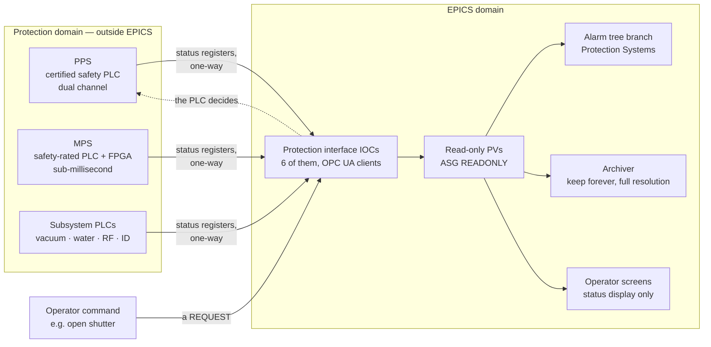

# Machine Protection

Where EPICS stops. This is the shortest chapter and the most important one.

!!! danger "EPICS is not a safety system"
    EPICS is a control and monitoring system. It has:

    - **no safety certification** of any kind;
    - **no deterministic latency guarantee** across the network;
    - **no failure analysis** you could put in front of a regulator;
    - **no authentication** on its write path ([Channel Access is unauthenticated](../architecture/protocols.md#security-posture-stated-plainly)).

    Personnel protection and machine protection functions belong in certified PLCs or hard-wired logic, designed and validated to the applicable standards (IEC 61508, IEC 61511, and your regulator's requirements). EPICS *monitors and displays* those systems. It must never *be* them.

    Nothing on this page or anywhere in this guide is safety engineering guidance. If you are designing a protection system, your reference is your facility's safety authority and the relevant standards — not a beginner's guide to a control system.

## The three systems at HLS

| System | Protects | Implementation | EPICS role |
| --- | --- | --- | --- |
| **PPS** — Personnel Protection System | **People** | Certified safety PLC + hard-wired interlocks, dual-channel, validated | **Read-only status.** Nothing else. |
| **MPS** — Machine Protection System | Equipment | Safety-rated PLC and FPGA logic, sub-millisecond | Read-only status; setpoint of *some* thresholds under change control |
| **Subsystem interlocks** | Individual equipment | Local PLCs and hardware | Read-only status; commands *requested*, not executed |

## What each one does

### Personnel Protection System

Prevents people being exposed to radiation. Governs:

- Tunnel and experimental hutch access — door interlocks, search-and-secure procedures, key control
- Beam shutters and safety shutters on all twenty front ends
- Radiation area monitors, interlocked to beam permit
- Emergency stops throughout the facility

It is dual-channel, fail-safe, independently validated, and subject to regulatory oversight and periodic re-certification. Changes to it are engineering change control, not a software deployment.

**Its own network is not reachable from any EPICS zone.** [The firewall table](network-design.md#firewall-summary) has one entry that says `Nothing` and this is it. Status flows *out* through a one-way interface — a set of PLC registers read by an EPICS IOC over [OPC UA](../toolbox/plc-and-fieldbus.md#opc-ua), with no write path.

In EPICS, the PPS appears as read-only PVs:

```text
HLS-CF-PPS-01:TunnelSearch-Sts       Tunnel searched and secured
HLS-CF-PPS-01:AccessState-Sts        Access / no access
FE-BL07-PPS-01:SafetyShutter-Sts     Shutter open / closed / fault
FE-BL07-PPS-01:HutchSearch-Sts       Hutch searched
HLS-CF-RAD-01:AreaMonitor-01-Mon     Radiation level
```

All `RAD`, `PPS` and `MPS` class PVs are in [ASG `READONLY`](operator-interfaces.md#access-control-in-practice), writable from nowhere. The [naming convention reserves those class codes](naming-convention.md#device-classes) so that anyone reading a PV list can see immediately which things EPICS merely observes.

### Machine Protection System

Prevents the beam and stored energy damaging equipment. Inputs include beam loss monitors, vacuum pressure, magnet water flow, RF interlocks, insertion device gap limits, and collimator temperatures. Outputs remove the beam permit — dumping the beam, inhibiting injection, or tripping the RF.

Response time is sub-millisecond and the logic is in safety-rated PLCs and FPGAs. **Not EPICS**, for the plain reason that a network protocol with no latency guarantee cannot be in a loop that must act in a millisecond.

In EPICS:

```text
HLS-CF-MPS-01:BeamPermit-Sts         The permit itself — read-only
HLS-CF-MPS-01:FirstFault-Sts         Which input tripped first
HLS-CF-MPS-01:TripTime-Mon           When
SR-C05-MPS-01:LossMonitor-Intlk      Per-location interlock status
```

`FirstFault` deserves a note. The MPS records which input tripped first, in *its* time base, and publishes it. That single PV answers the first question of every beam-dump investigation, and it comes from the protection system because only the protection system has a trustworthy view of the ordering at millisecond resolution. See [operations scenarios](operations-scenarios.md).

**Some MPS thresholds are settable from EPICS** — beam loss monitor trip levels, for instance — because they need adjusting during commissioning and machine studies. That path is:

- restricted to `ASG EXPERT` from named workstations;
- bounded by `DRVL`/`DRVH` in the record **and** by hard limits inside the PLC that EPICS cannot change;
- logged by [caPutLog](../toolbox/logbooks.md#caputlog);
- subject to a documented change-control procedure.

The PLC's internal limits are the actual protection. EPICS can adjust a threshold within a range the safety engineers approved, and cannot leave that range.

### Subsystem interlocks

The everyday ones, all in local PLCs:

| Interlock | Action |
| --- | --- |
| Vacuum pressure rise | Close sector valves |
| Magnet cooling water flow loss | Trip that magnet's supply |
| RF arc, reflected power, window overtemperature | Trip the amplifier |
| Insertion device gap limits and collision | Stop motion |
| Front-end absorber overtemperature | Close the shutter |
| Cryogenic quench detection | Dump the magnet current |

Every one of these must work when the network is down, the IOC has crashed, and nobody is in the control room. That requirement is what puts them in a PLC, and it is not negotiable by convenience.

## The interface



The dotted line is the important one. An operator "opening a shutter" writes to a *request* PV. The IOC passes the request to the PLC. **The PLC decides**, based on search state, radiation monitors, and interlocks that have nothing to do with EPICS. The shutter opens or it doesn't, and EPICS reports which.

If EPICS is down, the shutter cannot be requested — which is a *safe* failure, and the correct one.

## Why the line is drawn absolutely

Every argument for blurring it sounds reasonable in the moment. Each of these is a real thing people have proposed:

| The proposal | Why it fails |
| --- | --- |
| "It's just one extra check, and EPICS already has the data" | Now the safety case depends on Channel Access latency, IOC uptime, and an unauthenticated write path. The safety case is no longer valid. |
| "We'll add a `calc` record as a backup interlock" | An interlock nobody validated, that stops working when the IOC restarts, and that people will come to rely on. Worse than nothing, because it creates false confidence. |
| "The PLC is slow to change; we'll do it in EPICS for now" | "For now" becomes permanent. Every facility has an example. |
| "Access security will stop anyone writing to it" | [The user name is self-declared](../architecture/access-security.md#what-it-cannot-do). ASG rules protect against accident, not against intent, and never against a bug. |
| "It's only machine protection, not personnel" | Damaging a 15-magnet girder assembly is a months-long, multi-million-currency outage. Machine protection has its own real requirements. |
| "The operator can just watch the alarm" | An [alarm tells a human something; an interlock acts](alarm-plan.md#the-line-that-isnt-crossed). Humans are not a millisecond-latency component. |

The line holds because it is drawn on a principle, not case by case. Any exception process that evaluates proposals individually will eventually approve one, and then the boundary is a matter of judgement rather than architecture.

## What EPICS legitimately contributes

Considerable, and worth stating so the boundary doesn't read as a limitation:

**Visibility.** Every protection-system state is a PV: displayed, [archived forever at full resolution](archiving-plan.md#retention-policy-decided-once-and-written-down), and in the [alarm tree](alarm-plan.md). The protection systems act; EPICS is how humans understand what they did.

**Diagnosis.** After a trip, the [archive](archiving-plan.md) holds every relevant signal for the minutes before it, timestamped and correlated. `FirstFault` says what tripped; the archive says why. Investigations that would take days take an hour.

**Trend detection.** A beam loss monitor creeping toward its trip level over three weeks is visible in the archive and invisible in the moment. EPICS finds the problem before the protection system has to act.

**Correlation.** Water temperature, HVAC state, ground temperature, orbit, loss patterns — all archived on one time base, which is how the *cause* behind a recurring trip is eventually found.

**Operational support.** Displaying interlock chains so an operator knows which permit is missing and why, and turning a trip into a specific, actionable alarm with guidance.

That is a real and valuable role. It is simply not the role of *being* the protection system.

## Next

→ [A Beamline](beamline.md)
