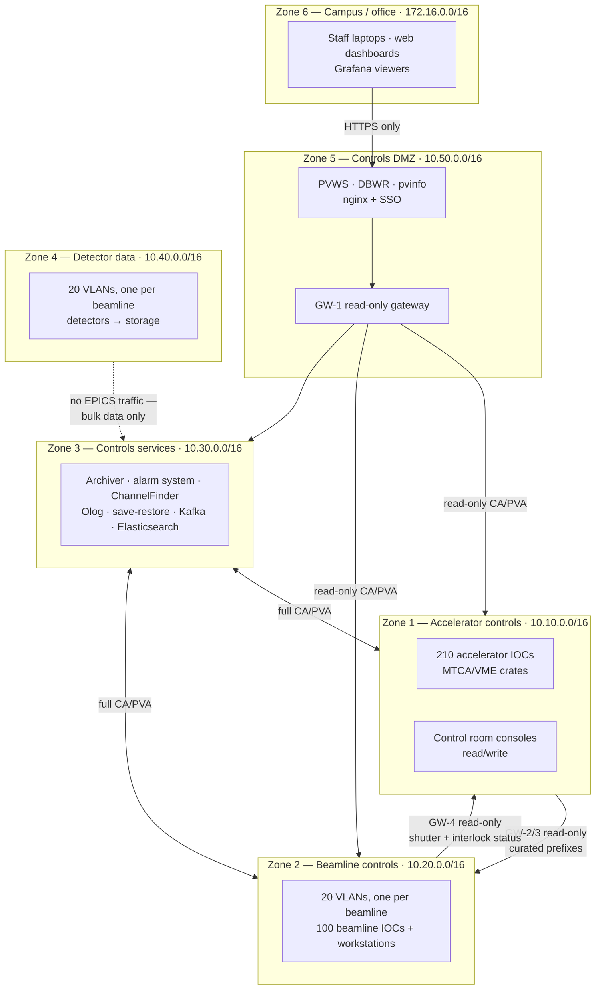

# Network Design

Six zones, five gateways, and one rule: **nothing outside the controls network can write to it, by topology rather than by configuration.**

Background: [Architecture → Networking](../architecture/networking.md) and [Gateways](../toolbox/gateways.md).

## The zones



| Zone | Subnet | Contents | Trust |
| --- | --- | --- | --- |
| 1 | `10.10.0.0/16` | Accelerator IOCs, control room consoles | Highest — full read/write |
| 2 | `10.20.0.0/16` | Beamline IOCs and workstations, one VLAN each | Per-beamline read/write within its own VLAN |
| 3 | `10.30.0.0/16` | Central services | Must reach 1 and 2; reachable from both |
| 4 | `10.40.0.0/16` | Detector data, one VLAN per beamline | Bulk data only; **no EPICS traffic** |
| 5 | `10.50.0.0/16` | Controls DMZ: gateways, web bridges | Read-only toward 1 and 2 |
| 6 | `172.16.0.0/16` | Campus network (existing IT) | Untrusted; HTTPS to zone 5 only |

## Why each boundary exists

### Zone 6 → Zone 5 is HTTPS only

No Channel Access ever crosses onto the campus network. Staff who want to look at the machine use [DBWR](../build-install/dbwr.md) or Grafana through nginx with SSO. Reasons:

- Campus is where laptops of unknown provenance live.
- HTTP is a protocol the IT security team can reason about; Channel Access is not.
- A web bridge is a much narrower attack surface than "CA reachability to 330 IOCs".

Staff wanting a native Phoebus client connect via a jump host into zone 5, not by extending CA onto campus.

### Zone 5 → Zones 1 and 2 is read-only by topology

**GW-1**, a [CA gateway](../build-install/gateways.md) with `RO` on every rule and no writable path configured at all. Not "writes are denied" — there is no rule that permits one, and no second gateway alongside it.

Because [Channel Access has no authentication](../architecture/protocols.md#security-posture-stated-plainly), a self-declared user name is not a boundary. A gateway that cannot forward a write is.

`pvlist` shape:

```text
EVALUATION ORDER ALLOW, DENY

SR-.*        ALLOW  RO
BO-.*        ALLOW  RO
LI-.*        ALLOW  RO
BL[0-2][0-9]-.*  ALLOW  RO
HLS-.*       ALLOW  RO
FE-.*        ALLOW  RO
.*           DENY
```

Everything readable, nothing writable, and the final `DENY` means a new prefix nobody thought about is excluded by default rather than exposed by default.

### One VLAN per beamline

Twenty VLANs in zone 2, `10.20.7.0/24` for BL07 and so on. Because:

- Beamlines are independent experiments with independent users and schedules. A broadcast storm on BL07 must not affect BL08.
- Visiting user equipment of unknown quality gets plugged in regularly.
- Each broadcast domain stays small, so CA discovery stays cheap.
- A beamline's own workstations can write to its own IOCs without any gateway, which is what beamline staff need.

### Zone 1 → Zone 2 is a curated read-only export

**GW-2 and GW-3** (two for load, not redundancy) export machine status to the beamlines. A curated prefix list, not `.*`:

```text
HLS-CF-DI-DCCT-01:.*          ALLOW  RO    # stored current
HLS-CF-MODE-01:.*             ALLOW  RO    # machine mode
HLS-CF-MPS-01:.*-Sts          ALLOW  RO    # beam permit status
SR-CF-DI-.*                   ALLOW  RO    # ring-wide diagnostics
SR-S[0-2][0-9]-ID-.*:Gap-RB   ALLOW  RO    # ID gaps (their own beamline's, plus others')
FE-.*:.*-Sts                  ALLOW  RO    # front-end and shutter status
.*                            DENY
```

Roughly forty PVs of interest per beamline, out of 265 000 in the accelerator. A curated list rather than a wildcard, because a beamline does not need — and should not have — read access to every RF diagnostic in the facility, and because a narrow list is a reviewable document.

### Zone 2 → Zone 1 is narrower still

**GW-4** lets the accelerator see what it needs from beamlines: front-end shutter requests, beamline interlock status, and whether a beamline is ready for beam. About ten PVs per beamline, read-only.

Note what this *doesn't* carry: 130 000 beamline PVs and 20 detectors' worth of traffic stay in zone 2. The accelerator has no reason to see them.

### Zone 4 carries no EPICS traffic at all

Detector data gets its own physical network and its own VLAN per beamline, sized for the data rate — a 4 MP camera at 20 fps is 1.3 Gbit/s, and the Eiger-class detectors are far worse. See [the beamline data path](beamline.md#the-data-path).

The detector's *control* PVs are on zone 2, where the rest of the beamline lives. Only bulk data is on zone 4, and it goes detector → storage without passing through EPICS. Mixing image bursts with vacuum readings on one VLAN adds latency to control traffic for no benefit.

### Zone 3 sits in the middle

Services must reach everything and be reachable by everything, so they route to zones 1 and 2 directly with full read/write — the [archiver](archiving-plan.md) needs to connect to every IOC, and the [alarm server](alarm-plan.md) likewise.

Note the inversion this creates: the tier nearest the beam (zone 1) has almost no external dependencies, and the tier furthest from it (zone 3) depends on Kafka, Elasticsearch, MariaDB and Kubernetes. That's deliberate — infrastructure complexity is kept away from the beam.

## Address allocation

| Range | Use |
| --- | --- |
| `10.10.1.0/24` | Accelerator IOC servers (12 hosts) |
| `10.10.2.0/24` | Embedded and crate controllers (~35) |
| `10.10.3.0/24` | Control room consoles |
| `10.10.10.0/24` | PLC and protection-system interfaces (read-only sources) |
| `10.10.20.0/24` | Fast orbit feedback network (isolated, deterministic) |
| `10.20.<n>.0/24` | Beamline *n* controls |
| `10.30.1.0/24` | Service hosts |
| `10.30.2.0/24` | Kubernetes service pods |
| `10.40.<n>.0/24` | Beamline *n* detector data |
| `10.50.1.0/24` | Gateways and web bridges |

The fast orbit feedback network is worth noting: 180 BPMs feeding an FPGA at 10 kHz over a deterministic fabric, physically separate from everything. It appears in EPICS only as configuration and diagnostics on zone 1.

## Client configuration

Per-zone site profile scripts, distributed by configuration management. Nobody sets these by hand.

=== "Zone 1 — accelerator"

    ```bash
    export EPICS_CA_AUTO_ADDR_LIST=NO
    export EPICS_CA_ADDR_LIST="10.10.1.255 10.10.2.255 10.30.1.255"
    export EPICS_PVA_AUTO_ADDR_LIST=NO
    export EPICS_PVA_ADDR_LIST="10.10.1.255 10.10.2.255 10.30.1.255"
    ```

=== "Zone 2 — beamline 7"

    ```bash
    export EPICS_CA_AUTO_ADDR_LIST=NO
    # own beamline, services, and the two accelerator-status gateways
    export EPICS_CA_ADDR_LIST="10.20.7.255 10.30.1.255 10.50.1.11 10.50.1.12"
    ```

=== "Zone 5 — DMZ web bridges"

    ```bash
    export EPICS_CA_AUTO_ADDR_LIST=NO
    export EPICS_CA_ADDR_LIST="10.50.1.10"     # GW-1 only, nothing else
    export EPICS_CA_MAX_ARRAY_BYTES=10000000
    ```

Zone 5's list containing exactly one address is the point: the web tier's entire view of the facility is what GW-1 chooses to show it.

Multi-homed IOC servers additionally set the server-side variables:

```bash
export EPICS_CAS_INTF_ADDR_LIST="10.10.1.42"        # controls interface only
export EPICS_CAS_BEACON_ADDR_LIST="10.10.1.255 10.30.1.255"
```

Without these, an IOC on a host with a controls interface and a management interface may serve on the wrong one, and be reachable from some places and not others with no pattern that makes sense.

## Firewall summary

| From | To | Allowed |
| --- | --- | --- |
| Zone 6 | Zone 5 | TCP 443 only |
| Zone 5 | Zones 1, 2 | Gateway host only: UDP/TCP 5064, UDP 5076/TCP 5075, outbound |
| Zone 3 | Zones 1, 2 | UDP/TCP 5064, 5065, 5075, 5076 — full |
| Zone 1 | Zone 3 | Same, plus service HTTP ports |
| Zone 1 | Zone 2 | Gateway hosts only |
| Zone 2 | Zone 1 | Gateway host only |
| Zone 4 | Anywhere | Storage network only; no EPICS ports |
| Anywhere | Zone 1 PLC subnet | **Nothing.** The protection systems' own network is not reachable. |

Both UDP and TCP, in both directions, for every EPICS path. A rule set permitting TCP but not UDP produces a system where nothing ever connects, and the error message mentions neither. It is the single most common controls-network misconfiguration.

## Time

- NTP from two facility servers, every host, alarmed on offset — [timestamps come from IOCs](../toolbox/timing-systems.md), so drift corrupts the archive.
- PTP on the diagnostics and detector segments.
- The [MRF event system](../toolbox/timing-systems.md#mrfioc2) for anything requiring beam-synchronous timestamps.
- **Everything in UTC.** Local time only at the point of display. Otherwise you get an ambiguous hour of archive data once a year.

## What this design gets right, and what it costs

**Right:** the write boundary is topological and therefore trustworthy; beamlines are isolated from each other; detector data can't degrade control traffic; a security review has a clear, honest answer.

**Costs:** five gateways to configure, monitor and keep in version control; per-zone client configuration that must be maintained centrally; and a genuine operational burden when someone legitimately needs write access across a boundary. That last one is the pressure that erodes network designs over time, and resisting it — with a documented exception process rather than an ad-hoc gateway rule — is most of the work of keeping this design real.

## Next

→ [Service Deployment](services-deployment.md)
