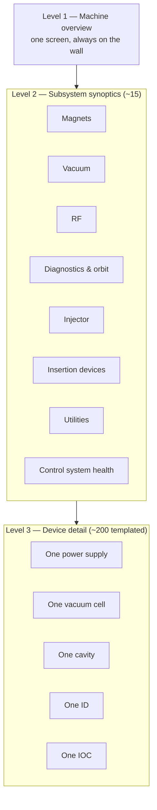

# Operator Interfaces

What an operator actually looks at, and why it's arranged that way. Screens are how the machine is understood at 03:00 under stress, which makes this less of a software question than it appears.

Toolkit background: [Toolbox → Operator Interfaces](../toolbox/operator-interfaces.md).

## The toolkit decision

**[Phoebus](../build-install/phoebus.md) everywhere**, with [DBWR](../build-install/dbwr.md) for browser access to the same `.bob` files.

Why one toolkit: an operator learns one thing. Displays, trends, the alarm tree, save/restore and the logbook are all in the same application, so "look at the trend and log it" is two clicks rather than three applications. And because DBWR renders the same files, the on-call engineer at home sees exactly what the operator sees — no parallel set of web screens to diverge.

Where HLS deviates: beamline scientists who want analysis embedded in a screen use [PyDM](../toolbox/operator-interfaces.md#pydm), because a matplotlib plot driven by live PVs is straightforward there and awkward in Phoebus. That's an accepted, documented exception for the experimental tier only. The accelerator control room is Phoebus, full stop.

## The screen hierarchy

Three levels. Operators navigate by structure, and a flat pile of 400 screens is unnavigable however good each one is.



### Level 1: the machine overview

One screen. Always displayed on the control room wall. Answers *"is the machine doing what it should?"* from across the room.

| Element | Source |
| --- | --- |
| Machine mode | `HLS-CF-MODE-01:Mode-Sts` |
| Stored current, large | `HLS-CF-DI-DCCT-01:Current-Mon` |
| Beam lifetime | `HLS-CF-DI-DCCT-01:Lifetime-Mon` |
| Beam permit | `HLS-CF-MPS-01:BeamPermit-Sts` |
| Time since last top-up, injection efficiency | Injector aggregation IOC |
| Orbit RMS, horizontal and vertical | Orbit aggregation IOC |
| Orbit feedback on/off and health | FOFB interface IOC |
| Per-subsystem summary, colour-coded by worst severity | `-Sum` PVs |
| 20 beamline shutter states | Front-end IOCs via GW-4 |
| Active alarm count by severity | [Alarm system](alarm-plan.md) |
| Current and 24-hour trend of stored current | [Archiver](archiving-plan.md) |

The subsystem summary row is the navigational heart of the screen: each tile is coloured by the worst alarm severity within that subsystem, and clicking it opens the level-2 synoptic. An operator sees *where* before reading any numbers.

Those `-Sum` PVs are computed **in IOCs**, by `calc` records with `MS` links inheriting severity from their inputs — not by the screen. So the archiver, the alarm system and every other client see the same summary. See [process database](../architecture/process-database.md#links-how-records-connect).

### Level 2: subsystem synoptics

Roughly fifteen, one per subsystem, each showing its whole subsystem geometrically: the ring drawn as twenty cells, with per-cell status.

The vacuum synoptic, for instance: twenty cells around a ring outline, each coloured by worst pressure severity, with the sector valve states drawn as they physically are. An operator sees a pressure rise's *location* immediately, and location is the first diagnostic question in a vacuum event.

### Level 3: device detail, templated

Around 200 distinct display files, opened thousands of times with different macros:

```text
sr_powersupply.bob?P=SR-C05-PS-QF-01
sr_vacuum_cell.bob?CELL=05
sr_cavity.bob?P=SR-CF-RF-CAV-01
insertion_device.bob?P=SR-S07-ID-U18-01
ioc_health.bob?IOC=sr-c05-va-ioc-01
```

One file per *device type*, not per device. All 900 power supplies share one display file. This is the same argument as [database templates](../architecture/process-database.md#templates-and-substitutions), for the same reason: 900 near-identical files diverge, and then a fix applies to one of them.

## Screen design rules

These are enforced in review, not suggested.

**Readback prominent, setpoint secondary.** Large readback, smaller editable setpoint clearly labelled. Confusing "what I asked for" with "what it's doing" is a dangerous class of error — see [naming](../architecture/naming-conventions.md#setpoint-versus-readback).

**Never override disconnected styling.** Phoebus marks disconnected widgets distinctively. A stale value presented as live is the most dangerous thing a screen can do.

**Colour by severity, everywhere.** From the record's `SEVR`, so screen and alarm system agree.

**Units on every number.** From `EGU`. A number without units is an invitation to a mistake.

**No logic in screens.** A screen that computes an interlock or holds a state machine only works while it's open on somebody's desktop. That logic goes in an [IOC](../architecture/process-database.md). This rule is the most frequently violated one in the industry and HLS enforces it in review.

**Every screen names its subsystem and links to its guidance.** So an operator on an unfamiliar screen at 03:00 knows what they're looking at and who owns it.

**Displays are version-controlled** in a repository, served over HTTP to both Phoebus and DBWR. They are configuration, and deserve history.

## The control room

| Position | Screens | Shows |
| --- | --- | --- |
| Wall | 4 large | Machine overview, alarm panel, orbit + current trends, beamline status |
| Operator 1 (machine) | 3 | Overview, active subsystem synoptic, alarm table |
| Operator 2 (injector/top-up) | 3 | Injector synoptic, injection efficiency trends, booster |
| Engineer-on-shift | 3 | Whatever they're investigating, plus control-system health |
| Physicist station | 3 | Physics applications, orbit tools, [optimisation](../toolbox/physics-and-optimization.md) |

Consoles are on [zone 1](network-design.md) with full read/write. [Access security](../architecture/access-security.md) restricts *which* PVs by host and by machine state, not by whether the person is nominally allowed.

## Access control in practice

Four groups, defined by **consequence** rather than by subsystem — forty subsystem-shaped groups would be incomprehensible:

| ASG | Writable from | Rule |
| --- | --- | --- |
| `OPERATOR` | Control room consoles | Normal operational setpoints |
| `BEAMAFFECTING` | Control room consoles | **Only when the beam permit is off** — a `CALC` rule on `HLS-CF-MPS-01:BeamPermit-Sts` |
| `EXPERT` | Control room + named engineer workstations | Subsystem tuning parameters |
| `READONLY` | Nowhere | Status from PLCs and protection systems |

Plus `DRVL`/`DRVH` on **every** output record — local, unbypassable, and set the day the record is created.

Phoebus greys out widgets the client lacks write access to, because CA reports access rights per channel. That feedback loop matters: an operator who can see a control is locked doesn't spend ten minutes wondering why their write had no effect.

## Web access

Through [DBWR](../build-install/dbwr.md) in [zone 5](network-design.md), behind nginx with SSO, behind GW-1 read-only:

- The same level-1 and level-2 screens, on a phone.
- Grafana dashboards over the [archiver](archiving-plan.md) for shift and management views.
- [pvinfo](../build-install/pvinfo.md) for "what is this PV?"

Read-only by topology, not by configuration. An on-call engineer at 03:00 can diagnose from home and cannot change anything — which is the correct trade, since anything requiring a change requires someone in the control room anyway.

## What the operators asked for

Because they use these twelve hours a day and are rarely asked. Three requests that changed the design:

**"Show me the last hour on every important number."** A sparkline beside every major value on the overview screen. An operator glancing at 500.2 mA cannot tell a stable machine from one that just recovered from 320 mA. Cheap to add, disproportionately useful.

**"Tell me what changed."** A "recent writes" panel fed from [caPutLog](../toolbox/logbooks.md#caputlog), showing the last twenty setpoint changes with who and when. Answers the most common control-room question without anyone having to ask it.

**"Don't make me hunt for the alarm's screen."** Every alarm's configuration includes the display to open, so the alarm table's context menu goes straight to the relevant screen. Filling in those `<display>` elements is tedious and it's the difference between an alarm system and a list of red rectangles.

## Next

→ [Archiving Plan](archiving-plan.md)
