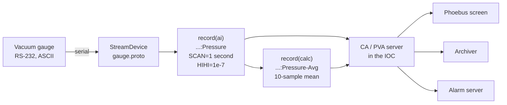

# Core Concepts

Eight ideas. Everything else in EPICS is built from these. If you understand this page you can read the rest of this guide, the mailing list, and most of the official documentation.

Official deep dive: [EPICS Process Database Concepts](https://docs.epics-controls.org/en/latest/guides/EPICS_Process_Database_Concepts.html).

## 1. Process variable (PV)

A named, network-accessible piece of data with a value, a timestamp, and an alarm status.

```text
name:      SR-C05-PS-QF-01:Current-RB
value:     102.375
units:     A
timestamp: 2026-07-29 14:03:21.442918
severity:  MINOR
status:    HIGH
```

Properties worth internalising:

- **The name is the address.** There is no host, no port, no path. `caget SR-C05-PS-QF-01:Current-RB` works from anywhere on the network that can reach the IOC serving it. Moving that IOC to another machine changes nothing for any client.
- **The namespace is flat and global.** All PV names in a network segment share one space, so name collisions are a real operational hazard — two IOCs serving the same name is a bug that shows up as randomly inconsistent readings. Hence [naming conventions](../architecture/naming-conventions.md) and [ChannelFinder](../toolbox/directory-services.md).
- **Names are length-limited.** Channel Access allows up to 60 characters (`PVNAME_STRINGSZ` is 61 including the terminator). Facility conventions are designed around that ceiling.
- **Timestamps come from the IOC**, not from the client, and not from the moment of transmission. If your IOCs' clocks aren't synchronised, your archive is fiction. See [timing systems](../toolbox/timing-systems.md).

## 2. Record

A record is the thing that *implements* a PV inside an IOC. It is an instance of a **record type**, and a record type is essentially a small state machine with a fixed set of fields and defined processing behaviour.

```text
record(ai, "SR-C05-VA-IP-03:Pressure") {
    field(DTYP, "stream")           # which device support to use
    field(INP,  "@gauge.proto get $(PORT)")
    field(SCAN, "1 second")         # process once per second
    field(EGU,  "mbar")             # engineering units
    field(PREC, "3")                # display precision
    field(HIGH, "1e-8")  field(HSV, "MINOR")   # alarm limits and severities
    field(HIHI, "1e-7")  field(HHSV, "MAJOR")
}
```

Key vocabulary:

- **Record type** — `ai` (analog in), `ao` (analog out), `bi`/`bo` (binary), `mbbi`/`mbbo` (multi-bit binary), `longin`/`longout`, `stringin`/`stringout`, `waveform`, `calc`, `calcout`, `seq`, `sub`, `aSub`, `fanout`, `motor`, and around forty more once modules are added. See the [record type reference](../reference/record-types.md).
- **Fields** — every record has `VAL`, `SCAN`, `DTYP`, `NAME`, `DESC`, `SEVR`, `STAT`, `TIME`, plus type-specific fields. Fields are addressable as PVs in their own right: `caget SR-C05-VA-IP-03:Pressure.EGU`. The bare PV name is shorthand for the `.VAL` field.
- **A PV name ≠ a record name, quite.** `MyRecord` and `MyRecord.VAL` are the same PV; `MyRecord.HIGH` is a different one on the same record. Aliases (`alias()`) let one record answer to several names.

The crucial insight: **records are wired to each other, not just to hardware.** A `calc` record whose inputs are three `ai` records, whose output drives an `ao` record, is a complete control loop with zero lines of programming. This declarative style is what makes EPICS databases both powerful and initially baffling. More in [Process Database](../architecture/process-database.md).

## 3. Database (`.db`) and the IOC's view of it

A **database** is just a collection of record instances — a text file, loaded at IOC startup.

- `.dbd` — *database definition*: declares which record types, device supports, and drivers exist. Provided by Base and by modules; you rarely write one.
- `.db` — *database instance*: your records. This is what you write.
- `.template` + `.substitutions` — a `.db` with `$(MACRO)` placeholders plus a table of values, expanded at load time. This is how you instantiate 176 identical BPMs without 176 copies of anything.

"Database" is a misleading word: it's in-memory, non-persistent, and evaluated continuously in real time. Nothing is written to disk unless you configure [autosave](../toolbox/soft-support-modules.md#autosave) or an [archiver](../toolbox/archiving.md).

## 4. IOC (Input/Output Controller)

A process that loads one or more databases, runs the device support that connects records to hardware, processes records on schedule, and serves the resulting PVs on the network.

An IOC is:

- an ordinary OS process (Linux, Windows, macOS, RTEMS, VxWorks);
- started by a **startup script**, `st.cmd`, which is a sequence of IOC-shell commands: load DBDs, load databases, configure ports, then `iocInit`;
- addressable through the `epics>` prompt on its console — `dbl` lists records, `dbpr` prints one, `dbtr` test-processes one, `casr` reports Channel Access clients.

Types you'll hear about:

| Term | Meaning |
| --- | --- |
| **Hard IOC** | An IOC on hardware with real I/O — VME crate, PLC front end, embedded board. Historically the only kind. |
| **Soft IOC** | An IOC with no local I/O hardware; talks over the network, or does pure logic. `softIoc` and `softIocPVA` ship with Base. Most IOCs at modern facilities are soft IOCs on rack servers. |
| **IOC application** | The buildable directory tree produced by `makeBaseApp.pl` — sources, databases, startup scripts, and a Makefile. |

One machine can host many IOCs. Whether you run one big IOC per rack or one small IOC per device is a genuine architectural decision with real trade-offs; see the [IOC inventory](../example-facility/ioc-inventory.md) for how the example facility decides.

## 5. Device support and drivers

The layered path from a record field to a wire.

```text
record (ai)  →  device support (DTYP)  →  driver / bus layer  →  hardware
```

- **Device support** adapts a record type to a class of device. Chosen with the `DTYP` field; the address goes in `INP`/`OUT`.
- **Drivers** handle the bus. [asyn](../toolbox/soft-support-modules.md#asyn) is the near-universal abstraction over serial, TCP, UDP, GPIB, USB and more, and most modern support is written against it.
- **[StreamDevice](../toolbox/plc-and-fieldbus.md#streamdevice)** is the escape hatch you will use most: it lets you describe an ASCII/binary protocol in a `.proto` text file instead of writing C. If a device speaks text over serial or TCP, StreamDevice can probably talk to it and you will write no code.

Writing C device support is a real skill and a last resort. Try, in order: an existing module → StreamDevice → asynPortDriver in C++ → C device support from scratch.

## 6. Channel Access (CA) and PV Access (PVA)

The two network protocols. Both are client/server, both do get / put / monitor, both discover servers by broadcast (or by configured address list).

| | Channel Access | PV Access |
| --- | --- | --- |
| Introduced | ~1990 | EPICS 7 (2017), from EPICS v4 |
| Data model | Scalar, array, plus fixed "DBR" compound types | Arbitrary structures ("normative types") |
| Typical use | The overwhelming majority of production traffic | Structured/aggregate data, new services, RPC |
| Tools | `caget`, `caput`, `camonitor`, `cainfo` | `pvget`, `pvput`, `pvmonitor`, `pvinfo`, `pvcall` |
| Default ports | 5064/5065 | 5075/5076 |
| Server in Base | `softIoc`, every IOC | `softIocPVA`, and `pvAccess` in any Base 7 IOC |

An EPICS 7 IOC serves both protocols simultaneously from the same records; a client picks one. Do not agonise over the choice early — use CA to learn, and reach for PVA when you need a structure, a table, an image with metadata attached, or an RPC-style service call.

Details, tuning, and the gotchas: [Protocols](../architecture/protocols.md).

## 7. Scanning: when does a record process?

Nothing in an IOC happens until a record **processes**. The `SCAN` field decides when.

| `SCAN` value | Behaviour |
| --- | --- |
| `Passive` | Only when something else asks — a link from another record, or a `caput` to the record. The default, and the most common. |
| `.1 second` … `10 second` | Periodic. Ten standard rates exist; more can be configured. |
| `I/O Intr` | The hardware interrupts, or the driver has new data. Efficient and low-latency — prefer this where support offers it. |
| `Event` | Triggered by a software or hardware event number. Used with [timing systems](../toolbox/timing-systems.md) to synchronise acquisition machine-wide. |

Records pull their inputs and push their outputs through **links** (`INP`, `OUT`, `FLNK`, `LNK1`…): a link may be `PP` (process passive — process the target first) or `NPP`, `CA` (force it through the network) or `CP`/`CPP` (monitor it). Getting these right is most of what "learning EPICS databases" means, and getting them wrong produces stale values, infinite loops, and unexplained lock-set contention. [Process Database](../architecture/process-database.md) goes deeper.

## 8. Alarms and severity

Every record carries an alarm **severity** and **status**, computed automatically from limit fields.

| Severity | Meaning by convention |
| --- | --- |
| `NO_ALARM` | Normal. |
| `MINOR` | Out of nominal range; worth noticing, not worth stopping for. |
| `MAJOR` | Out of acceptable range; operator action required. |
| `INVALID` | The value cannot be trusted — comms failure, hardware fault, unconverted raw value. **This is not "high" or "low", it means "unknown".** |

Set on analog records with `LOLO`/`LOW`/`HIGH`/`HIHI` and their severities `LLSV`/`LSV`/`HSV`/`HHSV`; on binary records with `ZSV`/`OSV`; and propagated between records by links, so a summary record can inherit the worst severity of its inputs.

`INVALID` deserves respect. A pressure reading of `0.0 INVALID` means the gauge controller stopped answering, not that the vacuum is perfect. Screens and archivers that ignore severity will cheerfully show you a flat green line while the instrument is unplugged.

Severity is what the [alarm system](../toolbox/alarms.md) consumes, and severity handling is why "just poll it with a script" is not equivalent to using EPICS.

## Putting it together



Read that left to right and you have described a working control system for one gauge. Everything at a real facility is this diagram repeated a few hundred thousand times, plus the services that make the repetition manageable.

## Next

- Do it for real: [Your First IOC](../build-install/first-ioc.md)
- Commands to poke at it: [Cheat Sheet](../reference/cheatsheet.md)
- Words you didn't recognise: [Glossary](glossary.md)
- The next layer of depth: [Process Database](../architecture/process-database.md) and [Protocols](../architecture/protocols.md)
