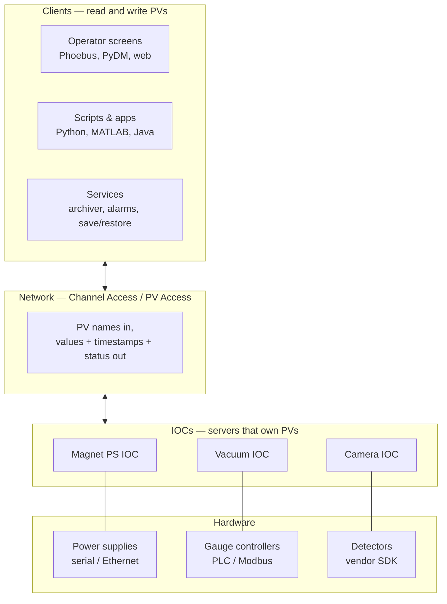

# What is EPICS?

**EPICS is a toolkit for building distributed control systems.** It is not an application you run; it is a set of libraries, conventions, and services from which you assemble the control system for your particular machine.

Official one-liner: [What is EPICS](https://docs.epics-controls.org/en/latest/guides/EPICS_Intro.html) on docs.epics-controls.org.

## The problem it solves

You have a machine — an accelerator, a telescope, a fusion experiment, a beamline, a test stand. It has some number of devices: power supplies, motors, vacuum gauges, temperature sensors, cameras, PLCs, RF amplifiers. They speak a dozen incompatible protocols over serial lines, Ethernet, fieldbuses, and VME backplanes. They are spread over hundreds of metres and dozens of racks.

You need to:

- read and write any device's parameters from anywhere, without knowing where the device physically is or what protocol it speaks;
- have every value carry a timestamp and an alarm status;
- record everything so that when something breaks at 03:00 you can see what led up to it;
- notice abnormal conditions and tell an operator;
- sequence operations automatically;
- do all of this with no single point of failure, and keep it working for 30 years while the hardware underneath is replaced twice.

EPICS is thirty-five years of accumulated answers to exactly that list.

## The central idea: the process variable

Everything in EPICS reduces to one abstraction. A **process variable** (PV) is a named piece of data, with a value, a timestamp, and an alarm status.

```text
SR-C05-PS-QF-01:Current-RB   =   102.375 A   2026-07-29 14:03:21.442918   NO_ALARM
└─────────── name ─────────┘      └ value ┘   └───── timestamp ─────┘      └ severity ┘
```

That's it. A magnet current, a vacuum pressure, a motor position, a camera image, an interlock bit, a piece of firmware version text — all PVs, all read and written the same way, all over the network, all with the same three commands.

The device driver knows it's a Modbus register. The archiver, the alarm server, the GUI, and the physicist's Python script do not, and never need to.

## The shape of a system



Three layers, and one rule that makes the whole thing work: **clients never talk to hardware, and IOCs never talk to each other's hardware.** Everything crosses the middle layer by PV name.

An **IOC** (Input/Output Controller) is a process that owns some PVs and serves them on the network. It may run on a rack-mounted Linux server, an embedded ARM board, a VME crate under RTEMS or VxWorks, or your laptop. There is no central server, no broker, and no master. Start twenty IOCs on twenty machines and they form one flat namespace. Kill one and the other nineteen carry on; clients of the dead one show "disconnected" and reconnect automatically when it returns.

That absence of a centre is the single most important architectural property of EPICS. It is why facilities can upgrade one subsystem on a Tuesday without a maintenance window.

## What EPICS gives you concretely

From [EPICS Base](../toolbox/base-and-iocs.md) alone:

- A **process database** — a declarative description of your control logic as interconnected [records](../architecture/process-database.md), evaluated on a schedule or on events, with no application code required for a surprising amount of real functionality.
- Two **network protocols**, [Channel Access and PV Access](../architecture/protocols.md), with client and server libraries.
- **Timestamps and alarm severity** attached to every value, propagated automatically.
- **Access security** — rules limiting who may write to what from where.
- A **build system** that cross-compiles the same source for Linux, macOS, Windows, RTEMS, and VxWorks.
- Command-line tools: `caget`, `caput`, `camonitor`, `pvget`, `pvput`, `softIoc`.

From the wider ecosystem, all optional and all separately released:

| Need | Ecosystem answer |
| --- | --- |
| Talk to real hardware | [asyn, StreamDevice, Modbus, ether_ip, opcua, motor, areaDetector](../toolbox/hardware-support-modules.md) |
| Operator screens | [Phoebus, PyDM, caQtDM, MEDM, EDM](../toolbox/operator-interfaces.md) |
| Screens in a browser | [DBWR, PVWS](../toolbox/web-interfaces.md) |
| History of everything | [Archiver Appliance, Phoebus RDB archiver](../toolbox/archiving.md) |
| Tell operators what's wrong | [Phoebus alarm system](../toolbox/alarms.md) |
| Find a PV by name or property | [ChannelFinder + recsync](../toolbox/directory-services.md) |
| Restore yesterday's settings | [save & restore, autosave](../toolbox/save-and-restore.md) |
| Record who did what, when | [caPutLog, Olog](../toolbox/logbooks.md) |
| Cross network boundaries | [CA Gateway, PVA Gateway](../toolbox/gateways.md) |
| Scan an experiment | [scan server, sscan, Bluesky](../toolbox/scanning-and-automation.md) |
| Scripting | [PyEpics, caproto, p4p, pvxs](../toolbox/client-libraries.md) |

The full catalogue is [The Toolbox](../toolbox/index.md).

## Who uses it

Several hundred facilities, including: APS, SNS, Jefferson Lab, SLAC, Fermilab, Brookhaven/NSLS-II, LBNL/ALS, Argonne, Diamond Light Source, ESRF (partly), PSI, DESY, ESS, MAX IV, ELETTRA, SOLEIL (partly), KEK, J-PARC, SPring-8, RIKEN, IHEP, SSRF, ANSTO, the Australian Synchrotron, ITER (in parts), LIGO, the Keck and Gemini telescopes, ALMA (in parts), the SKA precursors, and a long tail of university labs and industrial test stands running a single IOC on a single PC.

Scale ranges over five orders of magnitude, from one soft IOC with 20 PVs to facilities with well over a million.

## What EPICS is not

!!! danger "EPICS is not a safety system"
    EPICS is a control and monitoring system. It has no safety certification, no deterministic real-time guarantee across the network, and no failure analysis you could show a regulator. Personnel protection and machine protection interlocks belong in certified PLCs or hard-wired logic, designed to IEC 61508 / IEC 61511 and validated accordingly. EPICS *monitors* those systems and displays their state. It must never *be* them. See [Machine Protection](../example-facility/machine-protection.md).

**Not a hard real-time system, network-wide.** An individual IOC can run deterministic loops at kHz rates locally, especially on an RTOS. But Channel Access over Ethernet gives you no latency guarantee. Fast feedback (orbit feedback at 10 kHz, LLRF loops, machine protection) lives in FPGAs or dedicated hardware; EPICS sets its parameters and reads its diagnostics.

**Not a database in the SQL sense.** The "process database" is a set of in-memory records evaluated in real time. It is not persistent. Persistence comes from [autosave](../toolbox/soft-support-modules.md#autosave), [save & restore](../toolbox/save-and-restore.md), and the [archiver](../toolbox/archiving.md).

**Not a SCADA product.** No vendor, no licence, no support contract, no wizard. What you get instead is source, a mailing list where core developers answer questions, and thirty years of continuity.

**Not the only option.** [TANGO](https://www.tango-controls.org/) is the main alternative in the same community (ESRF, SOLEIL, ALBA, MAX IV runs both); [DOOCS](https://doocs-web.desy.de/index.html) at DESY, [SCADA products](https://ep-ews.web.cern.ch/) and CERN's own stack elsewhere. Mixed facilities are common, and bridges exist.

## Why the name is odd

"Experimental Physics **and Industrial** Control System" reflects a 1990s hope of adoption by industry that never really materialised. It began in 1988 as GTACS at Los Alamos (Bob Dalesio) and was jointly developed with Argonne (Marty Kraimer) for the Advanced Photon Source, becoming EPICS in 1991. The "industrial" half of the name is now mostly a historical artefact — though the software genuinely does run industrial-scale utility plant at several labs.

## Next

→ [Core Concepts](core-concepts.md) — the vocabulary you need before anything else makes sense.
