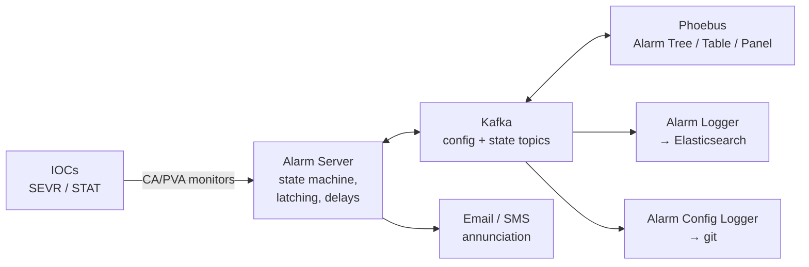

# Alarms

*"Press Acknowledge All and Reset All, they said. Everything will be fine, they said."*

An alarm system's job is to tell an operator the one thing they need to know right now. Its failure mode is telling them four thousand things, at which point it has become noise and they will stop looking at it — which is worse than having no alarm system, because everyone believes they're being watched over.

## Where alarms come from

Alarm state is **already in the records**. Nothing extra is needed to generate it:

```text
record(ai, "SR-C05-VA-IP-03:Pressure") {
    field(HIGH, "1e-8")   field(HSV,  "MINOR")
    field(HIHI, "1e-7")   field(HHSV, "MAJOR")
    field(HYST, "1e-9")                          # anti-chatter
}
```

Every record computes `SEVR` and `STAT` on every process. The alarm *system* is a set of services that subscribe to those fields, apply a hierarchy and a workflow, annunciate, and record what happened. See [core concepts](../start-here/core-concepts.md#8-alarms-and-severity).

## Phoebus Alarm System

The current standard. Three cooperating services plus Phoebus UI applications, coordinated through **Apache Kafka**.

| | |
| --- | --- |
| Documentation | [Alarm system UI](https://control-system-studio.readthedocs.io/en/latest/app/alarm/ui/doc/index.html) |
| Source | [github.com/ControlSystemStudio/phoebus](https://github.com/ControlSystemStudio/phoebus) |
| This guide | [Install the alarm system](../build-install/alarm-system.md) |



### Alarm Server

[Documentation](https://control-system-studio.readthedocs.io/en/latest/services/alarm-server/doc/index.html)

The engine. Monitors a configured PV list, maintains each alarm's state machine, and applies the logic that makes an alarm system usable rather than merely noisy:

- **Latching** — an alarm that goes away on its own still requires acknowledgement, so a transient that tripped the machine at 04:00 is still visible at 08:00. This is the feature that makes alarms an *operational record* rather than a live indicator.
- **Acknowledgement** with per-alarm state, so the display distinguishes "new" from "seen, being worked on".
- **Delays** — alarm only if the condition persists for N seconds. The single most effective anti-noise tool.
- **Counts** — alarm only if the condition occurs N times within a window. For intermittent faults that individually don't matter.
- **Enable/disable**, including scheduled disabling during known maintenance.
- **Hierarchy** — a tree of areas and subsystems, with severity propagating up so a top-level display shows where the problem is.
- **Automated actions** — email, or a command, on entering a state.
- **Guidance and displays attached to each alarm** — the text an operator reads at 03:00 and the screen they should open. This is where an alarm system earns its keep, and it's the part most often left empty.

### Alarm Logger

[Documentation](https://control-system-studio.readthedocs.io/en/latest/services/alarm-logger/doc/index.html)

Consumes the Kafka topics and writes every alarm transition and every acknowledgement into Elasticsearch. That gives you searchable alarm history: *how often does this trip, at what time of day, and who acknowledged it?*

Which is what you need for the only reliable way to improve an alarm system: **measure which alarms fire most, and fix or delete them.**

### Alarm Config Logger

[Documentation](https://control-system-studio.readthedocs.io/en/latest/services/alarm-config-logger/doc/index.html)

Records every configuration change into a git repository. Answers "who added this alarm, when, and why was that threshold changed?" — a question that comes up during every incident review.

### Why Kafka

It looks like heavy infrastructure for annunciating alarms. The payoff:

- **The configuration and the state are both logs**, so the alarm server holds no durable state of its own. Restart it and it rebuilds from Kafka in seconds.
- **Multiple UI clients** see identical state, and an acknowledgement in the control room appears instantly on the on-call engineer's laptop.
- **Replication** across brokers gives real durability for the alarm history.
- **Consumers are decoupled** — the logger, the UI, and any custom integration you write read the same topics without the server knowing.

The cost is a Kafka cluster to operate. For a facility this is worth it. For a test stand it is not, and record-level alarm limits displayed on a [Phoebus](operator-interfaces.md#phoebus) screen are entirely sufficient.

## Legacy and alternatives

| System | Status |
| --- | --- |
| **ALH** (Alarm Handler) | The original Motif alarm GUI. Still running at some facilities. Configuration files can inform a migration. |
| **BEAST** | The CS-Studio-era alarm system, RDB-backed. Direct ancestor of the Phoebus system; migration tooling exists. |
| **Grafana alerting** | Fine for infrastructure. **Not** an operational alarm system: no severity model, no latching, no acknowledgement workflow, no relationship to record fields. Don't let it become the machine's alarm system by accident. |
| **Facility-specific** | Several labs run their own, usually with local annunciation and paging integrations. |

## Alarm philosophy

The hardest part, and it isn't software. The relevant industrial standards are **IEC 62682** and **ISA-18.2** ("Management of Alarm Systems for the Process Industries"), and while a synchrotron isn't a refinery, the human factors are identical.

**Every alarm must require a specific operator action.** If the answer to "what should the operator do?" is "nothing" or "tell someone tomorrow", it is not an alarm. Make it a status indicator, a report, or a maintenance ticket.

**Target rate: an operator can handle roughly one alarm every few minutes, sustained.** Published guidance is around ten per hour average, with bursts tolerable. A system generating hundreds per hour is generating zero, because it is being ignored.

**Design for the flood.** A beam dump sets thousands of records into `MAJOR` within a second. If your display shows all of them, the operator cannot find the *cause*. Mitigations:

- **Hierarchy** — the top level says "STORAGE RING — MAJOR", and drilling down finds the first cause.
- **Delays** — consequential alarms with a 2–5 s delay let the root cause appear alone, first.
- **Suppression by state** — a machine in "beam off" mode should not alarm about the absence of beam. Use the alarm system's enable/disable, or [access-security-style state logic](../architecture/access-security.md).
- **First-out indication** — the diagnostic question is always *what tripped first*, and the alarm log answers it if timestamps are trustworthy. Another reason [clock synchronisation](timing-systems.md) is a correctness issue.

**Write the guidance text.** Every alarm gets: what it means, what the likely causes are, what to do, and who to call. Empty guidance fields are the difference between an alarm system and a list of red rectangles.

**Review the alarm log monthly.** Rank alarms by frequency. The top ten are your problem list — each is either a real recurring fault worth fixing, a threshold that's wrong, or an alarm that shouldn't exist. This single practice does more for alarm quality than any amount of configuration.

**Set thresholds where the record is, not where the screen is.** A screen-side threshold is invisible to the alarm system, the archiver, and everyone not looking at that screen.

**Use `HYST` and `MDEL`.** A value oscillating across a threshold generates an alarm storm from a single physical condition. Hysteresis costs one field.

!!! danger "Alarms are not interlocks"
    An alarm tells a human something. An interlock acts. They have different requirements, different reliability targets, and belong in different systems. Anything that must *act* to protect people or equipment belongs in [certified PLC or hard-wired logic](../example-facility/machine-protection.md); EPICS may alarm on it and display it, and must not be relied upon to perform it.

## Annunciation

Getting a human's attention:

| Channel | Notes |
| --- | --- |
| **Visual** — Phoebus alarm panel, always-on control-room display | The baseline. |
| **Audible** — Phoebus has an annunciator | Effective, and universally muted within a week if the rate is too high. Rate discipline is the prerequisite, not the volume. |
| **Email** — built-in automated action | Good for engineers, useless for anything urgent. |
| **SMS / paging / on-call** | Facility-specific integration, usually a script triggered by an automated action or a Kafka consumer. Route to a rota, not an individual. |
| **Chat integration** (Slack/Teams/Matrix) | Increasingly common via a Kafka consumer. Convenient; not a substitute for a rota with an escalation path. |

## Worked example

The [Helios alarm plan](../example-facility/alarm-plan.md) builds a complete hierarchy for a synchrotron: the tree structure, which subsystems get delays, how a beam-dump flood is kept legible, and the on-call routing.

## Next

→ [Directory Services](directory-services.md)
