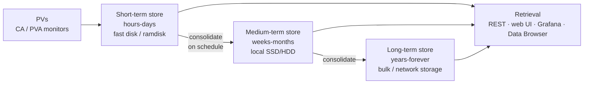

# Archiving

*"It's strange to have a control system without an archiver."*

Archiving is what turns a control system into an instrument you can reason about. Without it, every fault investigation begins with "what was it doing before?" and ends with "nobody knows."

## Two implementations

| | **EPICS Archiver Appliance** | **Phoebus RDB Archive Engine** |
| --- | --- | --- |
| Storage | Purpose-built multi-tier file store (+ MySQL/MariaDB for config) | Relational database (PostgreSQL, MySQL, Oracle) |
| Scale | Hundreds of thousands to millions of PVs, clustered | Thousands to tens of thousands |
| Setup effort | Higher — Tomcat, database, storage tiers, clustering | Lower — an engine plus a database |
| Retrieval | REST API, its own web UI, Grafana plugin, Phoebus Data Browser | Phoebus Data Browser, SQL |
| Best for | A facility | A beamline, test stand, or your first archiver |

Both are legitimate. The Appliance is what large facilities run; the RDB engine is easier to stand up and perfectly adequate at smaller scale.

## EPICS Archiver Appliance

| | |
| --- | --- |
| Source | [github.com/archiver-appliance/epicsarchiverap](https://github.com/archiver-appliance/epicsarchiverap) |
| Documentation | [epicsarchiver.readthedocs.io](https://epicsarchiver.readthedocs.io/) |
| Origin | SLAC (Murali Shankar); now community-maintained |
| Training | [Archive systems](https://controlssoftware.sns.ornl.gov/training/2022_USPAS/Presentations/19%20Archive.pdf) (USPAS) |
| This guide | [Install the Archiver Appliance](../build-install/archiver-appliance.md) |

### The multi-tier storage idea

The Appliance's central design decision, and the reason it scales:

Recent data lands on fast storage where writes are cheap and reads are frequent; scheduled jobs consolidate it into progressively larger, more compact files on progressively cheaper storage. Retrieval spans all three tiers transparently — a query for "last year" is answered from wherever the data is, and the client doesn't know or care.

You can also **decimate on the way down**: keep full resolution for a month and reduced resolution forever. That single feature is often the difference between an affordable archive and an unaffordable one.

### Other features that matter operationally

- **Clustering.** Multiple appliances share a cluster; each owns a subset of PVs; retrieval is federated. This is how you get past what one machine can ingest.
- **Automatic PV discovery** via [ChannelFinder](directory-services.md) integration, or bulk-add from a file.
- **Per-PV policies** — sampling method (monitor or scan), period, retention, decimation — chosen by name pattern in a Python policy file. Which means your [naming convention](../architecture/naming-conventions.md) determines how expressible your archiving policy is.
- **Pause/resume/rename** handling for PVs, including archiving a renamed PV as a continuation of the old one.
- **A genuinely good web UI** for adding PVs, checking status, spotting PVs that aren't connecting, and plotting.
- **Well-documented REST API** for retrieval, with JSON, CSV, and MATLAB output formats.

### Sampling: monitor vs scan

The most consequential per-PV choice you make.

| Method | Behaviour | Use for |
| --- | --- | --- |
| **MONITOR** | Subscribes; stores every update that passes the record's `ADEL` deadband | Almost everything. Captures transients; costs nothing when the value is quiet. |
| **SCAN** | Polls at a fixed period | Continuously-changing values where you want an even sample grid, or noisy PVs where monitor rate would be unbounded |

`MONITOR` with a well-chosen `ADEL` on the record is the right default: a temperature that doesn't move produces no data, and a step change is captured at full fidelity. `SCAN` at 1 Hz on 400 000 PVs is how you build an archive that costs more than the machine.

!!! warning "`ADEL` is set on the record, not the archiver"
    The archive deadband lives in the record's `ADEL` field, in the IOC, in the `.db` file. You cannot fix a badly-behaved archived PV entirely from the archiver side — it needs an IOC change. This argues strongly for setting `ADEL` when records are *created*, which means thinking about archiving during database design rather than after deployment.

## Phoebus RDB Archive Engine

| | |
| --- | --- |
| Documentation | [Archive engine service](https://control-system-studio.readthedocs.io/en/latest/services/archive-engine/doc/index.html) |
| Source | Part of [phoebus](https://github.com/ControlSystemStudio/phoebus) |

An archive *engine* reads an XML configuration of PVs, groups and sampling modes, subscribes, and writes to a relational database. Multiple engines can run, each with its own configuration.

Advantages: simple mental model, standard SQL storage you can query directly with tools you already have, tight [Phoebus Data Browser](operator-interfaces.md#phoebus) integration, much less to deploy.

Limits: relational storage becomes the bottleneck at facility scale, and there's no automatic tiering, so retention management is your problem.

**Good first archiver.** Many facilities start here and migrate to the Appliance when the row counts stop being funny.

## Retrieval and visualisation

| Route | Notes |
| --- | --- |
| **Phoebus Data Browser** | Live + archived on one plot, from either archiver. The operator's tool. |
| **Archiver Appliance web UI** | Ad-hoc plots, export, and status. The engineer's tool. |
| **[Grafana plugin](https://github.com/sasaki77/archiverappliance-datasource)** | Dashboards, shift displays, long-term trends. Listed in Grafana's catalogue as *Archiver Appliance*. |
| **REST API** | `.../retrieval/data/getData.json?pv=X&from=...&to=...` — for scripts and analysis |
| **Python** | The REST API plus pandas is the standard analysis path; several thin client wrappers exist |
| **`archapplpy`-style clients / MATLAB** | Community wrappers; check current maintenance before depending on one |

### Grafana integration

Worth its own note because it's how most people end up looking at archived data day to day. The [archiverappliance-datasource](https://github.com/sasaki77/archiverappliance-datasource) plugin (Hiroaki Sasaki, KEK) gives Grafana native access to the Appliance, including its server-side decimation operators — so a year-long plot of a 1 Hz PV doesn't try to transfer 31 million points to a browser.

## What to archive

The instinct is "everything", which is nearly right and needs qualification.

| Class | Policy | Why |
| --- | --- | --- |
| Readbacks of anything physical | MONITOR, sensible `ADEL`, keep forever | This is the machine's history. It is what you'll want in three years. |
| Setpoints | MONITOR, keep forever | Change history is essential for "what did we do?" and it's cheap — setpoints rarely move. |
| Alarm and status bits | MONITOR, keep forever | Tiny, and the timeline of a fault is built from these. |
| Interlock and permit states | MONITOR, keep forever | The most valuable data during an incident investigation. |
| Fast diagnostics waveforms | Selective, short retention, or event-triggered only | Large. Archive the *summary* continuously and the waveform on demand. |
| Images | Generally **not** in the archiver | Use the [file-writing path](detectors-and-imaging.md#file-writing-plugins). Archive metadata and statistics. |
| Internal / debug PVs | Don't | Noise, and they change meaning between releases. |
| IOC health from [iocStats](soft-support-modules.md#iocstats--deviocstats) | MONITOR, medium retention | Correlating "the readings went odd" with "that IOC restarted" is a very common investigation. |

**The asymmetry that decides these arguments:** storage is cheap and retroactive archiving is impossible. If in doubt, archive it — you cannot go back and collect last year.

Worked sizing arithmetic for a whole facility: [Helios archiving plan](../example-facility/archiving-plan.md).

## Operational guidance

**Monitor the archiver's own health.** Connected-PV count, disconnected-PV list, ingest rate, storage-tier utilisation, consolidation job success. Put it in [Grafana](observability.md) and alarm on it. An archiver silently not archiving is worse than no archiver, because everyone believes the data exists.

**Alarm on disconnected PVs.** A PV in the archiver's config that stopped connecting three months ago is a gap you'll discover exactly when you need the data.

**Back up the configuration database.** Losing the *list of what you archive*, with all its per-PV policies, is worse than losing samples — samples for a period are gone either way, but a lost configuration means you stop collecting *future* data correctly, and reconstructing thousands of per-PV policies is a project.

**Test retrieval, not just ingest.** Pull a year-old value quarterly. Discovering that the long-term store was never mounted, two years in, has happened to real facilities.

**Plan renames.** The archiver stores by name. A renamed PV becomes two half-histories unless you tell the archiver they're the same signal — the Appliance supports this, but only if you do it deliberately. See [aliases](../architecture/naming-conventions.md#aliases-and-the-migration-escape-hatch).

**Decide retention policy with the physicists, once, in writing.** "Forever" is a real answer and has a real cost; so is "one year at full resolution, decimated thereafter". What you must avoid is the unwritten default that turns out to be "until the disk filled".

## Next

→ [Alarms](alarms.md)
