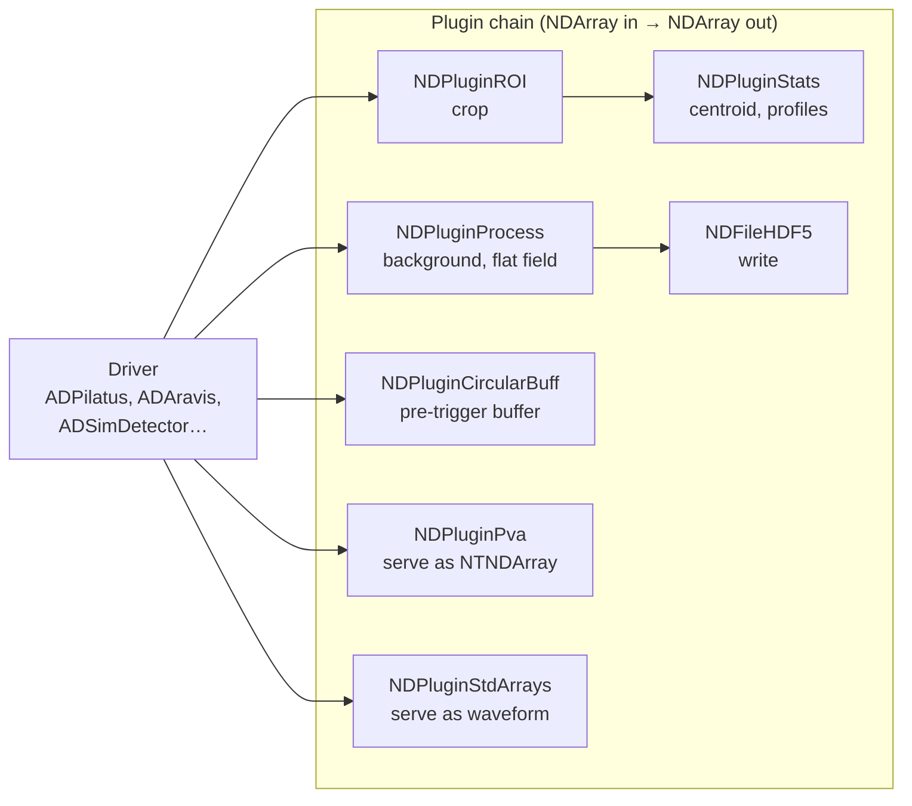

# Detectors and Imaging

Cameras and detectors are where EPICS stops being about small numbers and starts being about data rates. One framework dominates.

## areaDetector

| | |
| --- | --- |
| Organisation | [github.com/areaDetector](https://github.com/areaDetector) |
| Core | [ADCore](https://github.com/areaDetector/ADCore) |
| Documentation | [areadetector.github.io](https://areadetector.github.io/areaDetector/) |
| Maintainer | Mark Rivers (APS) and a large community |
| Training | [AreaDetector](https://controlssoftware.sns.ornl.gov/training/2022_USPAS/Presentations/16%20AreaDetector.pdf) (USPAS) |

areaDetector is big enough to have its own GitHub organisation, because each detector driver is a separate repository. The architecture:

**The model:** a driver produces `NDArray` objects into a queue. Plugins consume `NDArray`s and may produce more. Every plugin is independently configurable at runtime, has its own queue, and can be enabled or disabled without restarting. You wire up the chain you need in `st.cmd` and reconfigure the topology live.

Consequences worth understanding:

- **Each plugin has a queue, and queues drop.** A plugin that can't keep up drops arrays and increments a dropped-frame counter. **Monitor those counters** — silently dropped frames are the classic areaDetector data-integrity problem, and the counter is the only place it's visible.
- **Plugins run in their own threads**, so a slow file writer doesn't stall acquisition, up to the queue depth.
- **The driver's `ArrayCounter` and each plugin's counter should agree.** When they diverge, you have found where frames are being lost.

### Drivers

Roughly forty, covering:

| Category | Drivers |
| --- | --- |
| Area detectors | ADPilatus, ADEiger (Dectris), ADPerkinElmer, ADDexela, ADLambda, ADMerlin, ADPSL, ADmar345, ADmarCCD |
| Industrial cameras | ADAravis (GenICam/GigE Vision), ADSpinnaker and ADPointGrey (FLIR), ADVimba (Allied Vision), ADAndor / ADAndor3, ADPCO, ADPvCam (Photometrics), ADURL (anything with an HTTP image), ADUVC (USB webcams) |
| X-ray detectors | ADPilatus, ADEiger, ADXspress3, ADMythen, ADeVision |
| Electron/other | ADProsilica, ADFastCCD, ADQ (SP Devices digitisers) |
| Simulation | **ADSimDetector** — generates test patterns; the right starting point for learning |

If your camera speaks GenICam/GigE Vision (most industrial cameras do), **ADAravis** is likely all you need.

### File-writing plugins

| Plugin | Format |
| --- | --- |
| `NDFileHDF5` | HDF5, including [NeXus](scientific-data.md#nexus)-compatible layouts, compression (blosc, szip, zlib), and SWMR for reading while writing |
| `NDFileTIFF`, `NDFileJPEG`, `NDFilePNG` | Single-image formats |
| `NDFileNetCDF` | netCDF |
| `NDFileNexus` | NeXus via an XML layout template |
| `NDFileMagick` | Anything ImageMagick supports |

HDF5 with compression is the default choice for serious data. **SWMR** (single-writer/multiple-reader) matters operationally: it lets analysis start on a file that's still being written, which is the difference between live feedback and waiting for a scan to end.

### Serving images to clients

| Plugin | Protocol | Use |
| --- | --- | --- |
| `NDPluginStdArrays` | CA waveform | Legacy; works everywhere, no metadata, and CA array size limits bite |
| `NDPluginPva` | PVA `NTNDArray` | **The right answer.** Dimensions, data type, unique ID, timestamp, codec and per-frame attributes travel with the pixels as one structure |

This is the clearest practical case for [PV Access](../architecture/protocols.md#pv-access-pva): a CA waveform of pixels is just numbers, and you must reconstruct the geometry from separate PVs that may not be consistent with the frame you're holding. `NTNDArray` makes the image self-describing and atomic.

### Analysis plugins

`NDPluginStats` (centroid, sigma, profiles, histogram — the backbone of beam-position-from-camera measurements), `NDPluginROI` and `NDPluginROIStat` (multiple regions, each with statistics), `NDPluginProcess` (background subtraction, flat field, recursive averaging), `NDPluginTransform` (rotate/flip), `NDPluginColorConvert`, `NDPluginOverlay` (crosshairs and boxes drawn into the image for operators), `NDPluginAttribute`, `NDPluginTimeSeries`, `NDPluginFFT`, `NDPluginCodec` (compression/decompression), `NDPluginCircularBuff` (pre-trigger buffering — capture the N frames *before* an event), and `NDPluginPosPlugin` (tags frames with positions for [continuous scanning](motion.md#trajectory-and-continuous-scanning)).

Doing statistics in the plugin chain rather than in a client is usually right: it runs at IOC priority, produces ordinary PVs that the [archiver](archiving.md) and [alarm system](alarms.md) can consume, and doesn't depend on anyone's workstation being awake.

## Data rate reality

The arithmetic that determines your architecture:

| Detector | Frame | Rate | Raw data rate |
| --- | --- | --- | --- |
| USB webcam | 640×480×8 bit | 30 fps | 9 MB/s |
| GigE industrial camera | 2048×2048×16 bit | 20 fps | 160 MB/s |
| Dectris Eiger 4M | 2068×2162×32 bit | 750 Hz | ~13 GB/s |
| Fast X-ray detector at a 4th-gen source | — | — | 10s of GB/s |

Which forces, in order:

1. **A dedicated network** for detector data. A 160 MB/s camera is 1.3 Gbit/s — it does not belong on the VLAN carrying your vacuum readings. See [network design](../example-facility/network-design.md).
2. **Compression in the detector or the plugin chain**, not afterwards. `NDPluginCodec` with blosc costs CPU and saves a great deal of I/O.
3. **Direct-to-storage paths** for the fastest detectors, bypassing EPICS entirely: the detector writes to a parallel filesystem and EPICS handles control, metadata and monitoring only. Above roughly 1 GB/s this is the only workable architecture.
4. **Never routing full-rate data through CA/PVA to clients.** Serve a downsampled or ROI'd view for operators; the science data goes to files.

The general principle: **EPICS controls the detector; it does not have to carry the detector's output.** Newcomers often assume every byte must flow through the control system. It mustn't, and at high rates it can't.

## Related tools

| Tool | Purpose |
| --- | --- |
| [ADSupport](https://github.com/areaDetector/ADSupport) | Bundled third-party libraries (HDF5, TIFF, JPEG, zlib, blosc) so areaDetector builds without hunting system packages |
| [ADViewers](https://github.com/areaDetector/ADViewers) | Image viewers: ImageJ plugins, a Python PVA viewer |
| [ADPva](https://github.com/areaDetector/ADPva) | PVA-related components |
| [pvapy](client-libraries.md#pvapy) | Python PVA, widely used for `NTNDArray` processing pipelines |
| [Bluesky / ophyd](scientific-data.md#bluesky) | Orchestrating detectors within experiments |
| [Tiled](scientific-data.md#tiled) | Serving the resulting data to analysis clients |

## Practical guidance

**Start with ADSimDetector.** Build the whole plugin chain, the screens, the file writing, and the scan integration against simulated frames. Then swap in the real driver. This also gives you a permanent CI test.

**Watch the dropped-frame counters.** Put them on the operator screen and in the [alarm system](alarms.md). A detector quietly dropping 2% of frames produces data that looks fine and isn't.

**Understand your acquisition modes.** Single, Multiple, Continuous, and external-trigger modes behave differently in the driver, and the interaction between `NumImages`, `NumExposures`, `TriggerMode` and the plugin chain is where most commissioning time goes.

**Put per-frame metadata in NDAttributes.** Sample name, motor positions, ring current, monochromator energy — attached to the frame via `NDAttributesFile`, so it lands in the HDF5 file automatically and travels with the data forever. Metadata reconstructed later from archived PVs is a poor substitute and sometimes impossible.

**Think about disk before commissioning.** A detector that fills a filesystem stops an experiment, and "where do the files go, who deletes them, and when" is a policy question that must be answered before beam, not after.

## Next

→ [Timing Systems](timing-systems.md)
