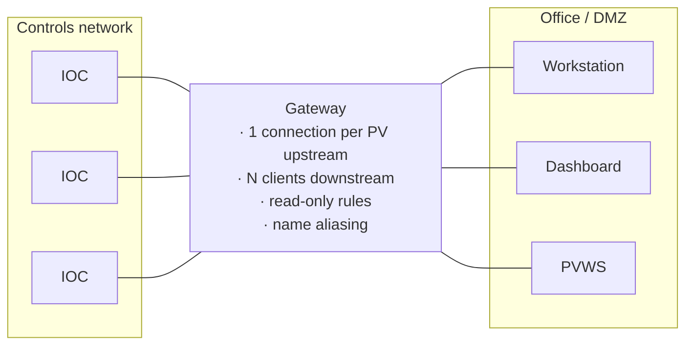

# Gateways

A gateway is a process that connects to IOCs on one network and re-serves their PVs on another. Two reasons to run one, both important.

**1. Connection multiplication control.** An IOC serving 400 workstations holds 400 TCP connections and sends 400 copies of every monitor update. Behind a gateway it holds *one*, and the gateway fans out. At facility scale this is not an optimisation; it's the difference between IOCs that control hardware and IOCs that serve screens.

**2. Policy enforcement.** Gateway rules allow, deny, or downgrade to read-only by PV-name pattern. Since [Channel Access has no real authentication](../architecture/protocols.md#security-posture-stated-plainly), a read-only gateway is the only *reliable* write boundary in EPICS — it doesn't matter what a client claims about itself if the gateway physically will not forward a write.



## CA Gateway

| | |
| --- | --- |
| Source | [github.com/epics-extensions/ca-gateway](https://github.com/epics-extensions/ca-gateway) |
| Protocol | Channel Access on both sides |

The long-standing, battle-tested one. Runs everywhere, has been in production for decades.

Configuration is two files:

**`pvlist`** — which PVs pass, and how:

```text
EVALUATION ORDER ALLOW, DENY

# Everything in the storage ring, read-only
SR-.*                ALLOW    RO

# Beam status to the beamlines, read-only
HLS-CF-DI-.*         ALLOW    RO

# This beamline may write to its own PVs
BL07-.*              ALLOW    RW  1

# Nothing else gets through at all
.*                   DENY
```

**`access`** — access-security-style groups referenced by rules in `pvlist`, using the same syntax as an IOC's [`.acf`](../architecture/access-security.md).

Also supports **name aliasing** via regex substitution in `pvlist`, so a gateway can present PVs under different names — occasionally invaluable during a facility rename, since the old names keep working through the gateway while IOCs serve the new ones.

The gateway exposes its own statistics PVs (connected channels, client count, CPU, VMS) which you should archive and alarm on; a gateway at its connection limit degrades everything behind it.

## p4p PVA Gateway

| | |
| --- | --- |
| Documentation | [epics-base.github.io/p4p/gw.html](https://epics-base.github.io/p4p/gw.html) |
| Source | Part of [p4p](https://github.com/epics-base/p4p) |
| Protocol | PVA on both sides |

The modern PVA gateway, and — usefully — it can be configured to **bridge CA to PVA**, so a PVA client can reach CA-only IOCs. Configured in JSON, with per-client-group rules, and it supports the same read-only and pattern-matching concepts.

For new PVA deployments this is the one to use.

## pva2pva

The original PVA-to-PVA gateway, in [github.com/epics-base/pva2pva](https://github.com/epics-base/pva2pva). Historically important; superseded in practice by the p4p gateway. You'll see it referenced in older documentation.

## Deployment patterns

### Read-only export to the office

The single most common deployment, and the one every facility needs.

```text
Controls network ──[read-only gateway]──> Office network
```

Staff see everything and can change nothing. `pvlist` is `.* ALLOW RO` plus explicit denials for anything genuinely sensitive. This is a *topological* guarantee, not a policy, which is exactly why it's trustworthy.

### Beamline ↔ accelerator

```text
Accelerator network ──[read-only, curated prefix list]──> Beamline networks
```

Beamlines need machine status: stored current, energy, shutter permits, top-up state, machine mode. They must not write to the storage ring. The `pvlist` names the specific prefixes exported — a curated list, not `.*`, because the accelerator's full namespace is 250 000 PVs and a beamline needs about forty of them.

Some facilities also run the reverse: a narrow gateway letting the accelerator read beamline shutter and interlock status.

### Load reduction in front of busy IOCs

Where many clients monitor the same PVs — a synoptic display open on thirty consoles — a gateway in the same network segment collapses the fan-out even with no policy purpose. Purely a performance deployment.

### Test/development isolation

A gateway exporting production PVs **read-only** into a development network lets test software work against real data without any possibility of touching the machine. Much safer than developing against production directly, and much more realistic than developing against simulation alone.

Note the complementary trick: running a separate EPICS "universe" on a different `EPICS_CA_SERVER_PORT` gives complete isolation with no gateway at all. Useful for a test system on the same physical network — and a memorable way to make PVs invisible if you forget you did it.

## Operational guidance

**Read-only unless there is a written reason otherwise.** And when there is, make the writable path a *separate* gateway with a narrow `pvlist`, not a relaxation of the read-only one. Two processes with different rules is much easier to reason about, review, and audit than one process with exceptions.

**Version-control the rule files.** `pvlist` and `access` are security configuration. They belong in git with review, and they must be deployed by configuration management rather than edited in place. A gateway rule file edited at 2 a.m. by someone debugging is how boundaries quietly disappear.

**Monitor the gateway.** Its statistics PVs, its CPU, and its connection count — archived and alarmed. A gateway is a single point of failure for everything behind it, and its degradation looks like "the whole control system got slow".

**Watch array size limits.** Large waveforms must be within limits at the client, the gateway, **and** the IOC. A gateway configured with a smaller maximum than the IOC silently truncates arrays, and the symptom looks like data corruption rather than a configuration error. See [protocols](../architecture/protocols.md#configuration-that-matters).

**Beware transitive reachability.** A gateway makes PVs available to everything on its downstream network. If that network is later connected to something else, your boundary has moved and nobody updated the gateway. Review the network topology when you review the rules, not separately.

**Don't chain gateways deeply.** Each hop adds latency, another set of limits to align, and another place for a connection to be dropped. One hop between zones. Two if you must. Three means somebody should redraw the network.

**Gateways don't fix a bad namespace.** If your [naming convention](../architecture/naming-conventions.md) makes it impossible to express "all storage ring PVs" as a pattern, your gateway rules become an unmaintainable list of special cases — and a security boundary you can't read is not a security boundary.

## Next

→ [Scanning & Automation](scanning-and-automation.md)
