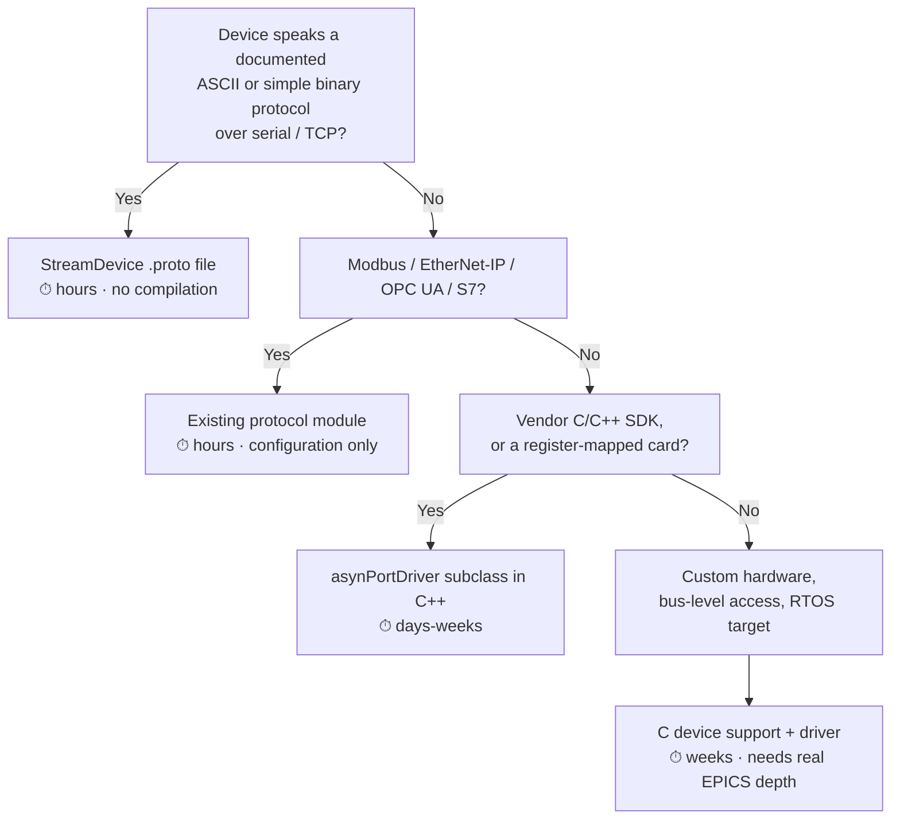

# Hardware Support Modules

A **hardware support module** provides in-IOC software to control a specific real-world device or device family.

Official directory: **[epics-controls.org — Hardware Support](https://epics-controls.org/resources-and-support/modules/hardware-support/)** — this is the searchable list of hundreds of devices with maintainers and links. Check it before writing anything.

## How to find support for your device

In order:

1. **The [hardware support directory](https://epics-controls.org/resources-and-support/modules/hardware-support/).** Search by manufacturer and model.
2. **[github.com/epics-modules](https://github.com/epics-modules)** and **[github.com/areaDetector](https://github.com/areaDetector)**. Repository names are usually the device or family.
3. **Search [tech-talk](../reference/community.md)** for the model number. Somebody has almost certainly asked. If the answer is "we wrote a StreamDevice protocol", ask for it — people share these freely.
4. **Facility GitHub organisations** — [Diamond](https://github.com/DiamondLightSource), [PSI](https://github.com/paulscherrerinstitute), [SLAC](https://github.com/slaclab), [ESS](https://gitlab.esss.lu.se), [NSLS-II](https://github.com/NSLS-II), [ISIS](https://github.com/ISISComputingGroup). Facilities publish far more than they announce.
5. **Ask on tech-talk.** Include the model number and the manual's protocol section. This is a normal, welcome question.
6. **Write it yourself.** In escalating order of effort: a [StreamDevice](plc-and-fieldbus.md#streamdevice) `.proto` file → records over generic [asyn](soft-support-modules.md#asyn) support → an `asynPortDriver` subclass in C++ → C device support from scratch.

!!! tip "Steps 1–5 before step 6, seriously"
    The commonest avoidable waste of a new controls engineer's first month is writing device support that already existed. Twenty minutes of searching is worth it every time.

## Categories, with the modules that matter

Detailed pages exist for the big ones:

- **[PLCs & fieldbus](plc-and-fieldbus.md)** — Modbus, EtherNet/IP, S7, OPC UA, ADS, EtherCAT, StreamDevice
- **[Motion](motion.md)** — the `motor` module and its several dozen controller drivers
- **[Detectors & imaging](detectors-and-imaging.md)** — areaDetector and its ~40 camera and detector drivers
- **[Timing](timing-systems.md)** — event generators/receivers, White Rabbit, delay generators

### Vacuum

| Device family | Support |
| --- | --- |
| Pfeiffer, Leybold, Edwards gauge controllers and turbo pumps | Usually [StreamDevice](plc-and-fieldbus.md#streamdevice) protocol files; many published by facilities |
| Agilent/Varian ion pump controllers | StreamDevice; check facility repos |
| MKS gauges and mass-flow controllers | StreamDevice, or Modbus/serial variants |
| Gamma Vacuum SPCe | Published protocols in several facility repos |
| Valve control | Almost always via a [PLC](plc-and-fieldbus.md) — vacuum valve interlocks are protection logic and belong there |

Vacuum is the classic StreamDevice domain: nearly every controller speaks ASCII over RS-232/RS-485, and a `.proto` file is a couple of hours' work.

### Power supplies

| Family | Notes |
| --- | --- |
| Danfysik | Widely used in accelerators; StreamDevice or facility-specific drivers |
| TDK-Lambda / Genesys, Delta Elektronika, Kepco | StreamDevice over serial/Ethernet, or Modbus/TCP |
| Bruker, Caen | Vendor protocols; check facility repos |
| Corrector supplies in a fast feedback loop | The *feedback* is FPGA-based; EPICS handles setpoints and diagnostics only |

### Temperature and cryogenics

| Device | Support |
| --- | --- |
| Lakeshore 218/224/336/350 controllers | Well-supported; StreamDevice and dedicated modules widely published |
| Cryomech, Sumitomo coldheads | Serial, StreamDevice |
| Cryo plant | Almost always a large PLC/SCADA system; EPICS reads it via [OPC UA](plc-and-fieldbus.md#opc-ua) or Modbus |
| Thermocouples and RTDs | Via a datalogger, PLC analog input, or a dedicated card; conversion via `ai` record breakpoint tables (`LINR`) |

### Digitisers, ADCs, and I/O crates

| Family | Notes |
| --- | --- |
| MTCA/AMC digitisers (Struck, IOxOS, CAEN) | Vendor-specific drivers, often facility-maintained; MTCA is the modern standard for fast diagnostics |
| VME boards (Joerger, Hytec, Acromag) | Long-standing modules in `epics-modules`; the legacy that still runs |
| IndustryPack carriers | [ipac](https://github.com/epics-modules/ipac) |
| CAEN, NI, Measurement Computing USB DAQ | [measComp](https://github.com/epics-modules/measComp) covers Measurement Computing; others vary |
| Beam-charge / current amplifiers | [quadEM](https://github.com/epics-modules/quadEM) for four-channel electrometers |

### Beam diagnostics

Diagnostics is the least standardised area, because the electronics are usually facility-specific or bespoke:

| Device | Reality |
| --- | --- |
| BPM electronics (Libera, BPM-FPGA designs) | Vendor or facility drivers; often a thin asyn layer over a register map |
| Beam current monitors (DCCT, ICT) | Analog → ADC → `ai` records, or vendor digital interface |
| Screens / flags / YAG monitors | Motion ([motor](motion.md)) + camera ([areaDetector](detectors-and-imaging.md)) |
| Beam loss monitors | Digitiser plus threshold logic, with the *interlock* function in [MPS hardware](../example-facility/machine-protection.md) |
| Wire scanners, emittance monitors | Motion + acquisition + a [sequencer](scanning-and-automation.md#sequencer-snl) or scan |

### RF and LLRF

| Layer | Where it lives |
| --- | --- |
| Fast amplitude/phase regulation | FPGA. Not EPICS. |
| Setpoints, ramps, mode control | EPICS, via the LLRF system's register interface or a vendor driver |
| Waveform diagnostics | Large waveform records, often over [PVA](../architecture/protocols.md#pv-access-pva) for the metadata |
| Interlocks (arc, reflected power, window temperature) | Hardware, reported into EPICS read-only |

### Insertion devices, undulators

Usually a combination: [motion](motion.md) for gap and phase, a PLC for the safety-relevant limits, and a coordination layer — often a [sequencer](scanning-and-automation.md#sequencer-snl) program or a dedicated IOC — implementing the taper/gap/phase relationships and the feed-forward tables that keep the ring's tune stable as the gap moves.

### Beamline optics

| Device | Support |
| --- | --- |
| Monochromators, mirrors, slits | [motor](motion.md), often with coordinated pseudo-motors |
| Piezo fine stages | Vendor drivers over serial/Ethernet |
| Attenuators, filters | Pneumatic actuators via PLC or digital I/O |
| Shutters | PLC — a shutter is protection equipment |

## Writing your own: the decision tree

Whatever route you take:

- **Read an existing module first.** [asyn's](https://github.com/epics-modules/asyn) examples and any small `epics-modules` driver are better teachers than the documentation.
- **Test against a simulator.** [Lewis](simulation-and-testing.md#lewis) lets you develop the protocol handling before the hardware arrives, and lets your CI test it forever afterwards.
- **Use `asynRecord` to explore the protocol** before writing anything — send strings from a screen and watch the replies.
- **Turn on asyn trace masks** when it doesn't work. `asynSetTraceMask("PORT",-1,0xff)` shows every byte on the wire.
- **Publish it.** Put it on GitHub, tell tech-talk, and add it to the hardware support directory. Someone else has your instrument, and the ecosystem is built entirely from people who did this.

## Next

→ [PLCs & Fieldbus](plc-and-fieldbus.md)
