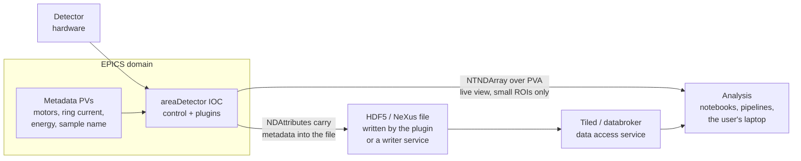

# Scientific Data

EPICS controls the instrument. Getting the *science* out — orchestrated acquisition, structured files, metadata, and analysis access — is a layer above, and it's where the beamline software community has built most of its recent work.

## Bluesky

| | |
| --- | --- |
| Home | [blueskyproject.io](https://blueskyproject.io/) |
| Origin | NSLS-II (Brookhaven); now a multi-facility collaboration |
| Language | Python |

Not an EPICS tool as such — an **experiment orchestration framework** that happens to drive EPICS very well. Adopted at NSLS-II, Diamond, ALS, APS and others.

The components:

| Component | Role |
| --- | --- |
| **bluesky** | The run engine. Executes *plans* — generator functions that yield messages like "set this", "trigger that", "read those". |
| **[ophyd](https://blueskyproject.io/ophyd/) / [ophyd-async](https://blueskyproject.io/ophyd-async/)** | Device abstraction. Wraps EPICS PVs into Python objects with a uniform `set`/`trigger`/`read`/`stage` interface. |
| **[databroker](https://blueskyproject.io/databroker/)** | Retrieval of past runs as structured data. |
| **[Tiled](#tiled)** | The modern data access service that databroker fronts. |
| **event-model** | The document schema: `start`, `descriptor`, `event`, `stop`. Every run is a stream of these. |
| **[queueserver](https://blueskyproject.io/bluesky-queueserver/)** | Runs plans as a supervised service with a queue and a REST API, rather than in somebody's terminal. |

```python
from bluesky import RunEngine
from bluesky.plans import scan
from ophyd import EpicsMotor, EpicsSignalRO

RE = RunEngine({})
sample_x = EpicsMotor('BL07-EA-STAGE-01:X', name='sample_x')
detector = EpicsSignalRO('BL07-EA-DET-01:Stats1:Total_RBV', name='detector')

RE(scan([detector], sample_x, -5, 5, 101))
```

**What it gets right:** the *document model*. Every run produces a self-describing stream containing not just the data but the plan, the devices, the metadata, and the timestamps. That means analysis code doesn't need to know how the scan was performed, and a run from 2019 is still readable. Solving metadata provenance properly, rather than as an afterthought, is the core contribution.

**Where it belongs:** experiments. It is a Python session, so a Bluesky plan does not survive a closed laptop, and nothing the *machine* depends on should live there. Use `queueserver` to make it a supervised service if beamline operations depend on it. See [Scanning & Automation](scanning-and-automation.md).

### ophyd / ophyd-async

Worth understanding separately, because it's the boundary between EPICS and everything above it. `ophyd` wraps PVs into device objects:

```python
class Slits(Device):
    top    = Cpt(EpicsMotor, '-TOP')
    bottom = Cpt(EpicsMotor, '-BOT')
    gap    = Cpt(EpicsSignal, ':Gap-SP')
```

Higher layers then interact with a `Slits` object, never with PV names. `ophyd-async` is the asyncio rewrite, designed around high-throughput detectors and hardware-triggered ("flyer") scanning, and is where new development is happening.

The design tension is worth naming: ophyd device definitions duplicate structure that already exists in the IOC's database. Facilities resolve it by *generating* ophyd definitions from the same source that generates the database — which is another argument for [PVI](deployment-and-operations.md#pvi) and for treating device descriptions as the primary artefact.

## Tiled

| | |
| --- | --- |
| Documentation | [blueskyproject.io/tiled](https://blueskyproject.io/tiled/) |

A data access service: serves arrays, tables and hierarchical structures over HTTP with slicing, so a client fetches the 2 GB dataset's interesting 5 MB rather than the file. Handles authentication and access control, which matters when user data must be visible to its owners and nobody else.

The problem it solves: analysis clients previously needed filesystem access to the storage, which forces every analysis machine onto the facility's storage network and makes remote analysis painful. Tiled makes data access an API.

## NeXus

| | |
| --- | --- |
| Home | [nexusformat.org](https://www.nexusformat.org/) |

The community standard for neutron, X-ray and muon data — an HDF5 layout convention (application definitions) specifying where the data, axes, units, instrument geometry and sample information go.

Why bother: a NeXus file is readable by generic tools and by other facilities' analysis software, years later, without a facility-specific reader. A bespoke HDF5 layout requires your documentation to survive, and it usually doesn't.

Written from EPICS by the [areaDetector HDF5 plugin](detectors-and-imaging.md#file-writing-plugins) (with an XML layout definition) or `NDFileNexus`, or assembled by a writer service consuming a document stream.

## HDF5

| | |
| --- | --- |
| Home | [hdfgroup.org](https://www.hdfgroup.org/solutions/hdf5/) |

The container underneath nearly all of this. Relevant features:

- **Chunking and compression** — blosc, zlib, szip, and specialist codecs. Chunk shape should match your read pattern, and getting it wrong can cost an order of magnitude in analysis time.
- **SWMR** (single-writer/multiple-reader) — read a file that's still being written. This is what makes live analysis during a scan possible.
- **Virtual datasets** — present many files as one logical array, which is how multi-module detectors and multi-scan datasets are stitched.

## The full path, and where EPICS stops



The critical design decision: **bulk data does not flow through Channel Access.** EPICS controls the detector, provides the metadata, and serves a downsampled live view. The science data goes detector → file → data service → analysis. Above a few hundred MB/s that isn't a preference, it's the only thing that works. See [Detectors & Imaging](detectors-and-imaging.md#data-rate-reality).

## Facility ecosystems

Beamline data software is more facility-divergent than any other part of EPICS. Worth knowing the main families:

| Facility family | Stack |
| --- | --- |
| **NSLS-II, ALS, and collaborators** | Bluesky + ophyd + Tiled, end to end. The reference implementation. |
| **Diamond** | Bluesky/ophyd-async and GDA, with `pandABlocks` and malcolm-style hardware-triggered scanning |
| **APS** | Historically [sscan](scanning-and-automation.md#sscan) + saveData with SPEC; increasingly Bluesky |
| **ESRF, SOLEIL** | TANGO-centric, with BLISS as the orchestration layer |
| **ESS** | Kafka-based streaming data (`ess-dmsc`), NeXus file writers consuming the stream |
| **Many beamlines everywhere** | **SPEC** — [certif.com](https://certif.com/) — the commercial diffractometer control package. Decades of entrenchment; several EPICS integration paths exist. |

If you're joining a beamline, the local answer here is a much stronger constraint than any technical comparison.

## Guidance

**Capture metadata at acquisition time, in the file.** Motor positions, ring current, energy, temperatures, sample identity, and the scan's intent — attached to the frames via [NDAttributes](detectors-and-imaging.md), not reconstructed later from the archiver. Reconstruction is lossy, error-prone, and sometimes impossible, and you only discover which when someone asks about a two-year-old dataset.

**Use a standard format.** NeXus/HDF5. A bespoke layout is a decision to maintain a reader forever, and to make your data unusable by anyone who doesn't have it.

**Decide who deletes data, and when, before first beam.** Not a software question, and it will become urgent at exactly the wrong moment. A full filesystem stops an experiment.

**Keep the control system out of the bulk data path.** EPICS's job is control, configuration, metadata and monitoring. It is not a data transport, and using it as one produces a system that works in commissioning and collapses at design rate.

**Version the analysis, not just the data.** A dataset without the code that produced its calibration is much less useful than it appears. This is where the document-model approach earns its keep — provenance recorded automatically beats provenance recorded by discipline.

## Next

→ [Physics & Optimisation](physics-and-optimization.md)
