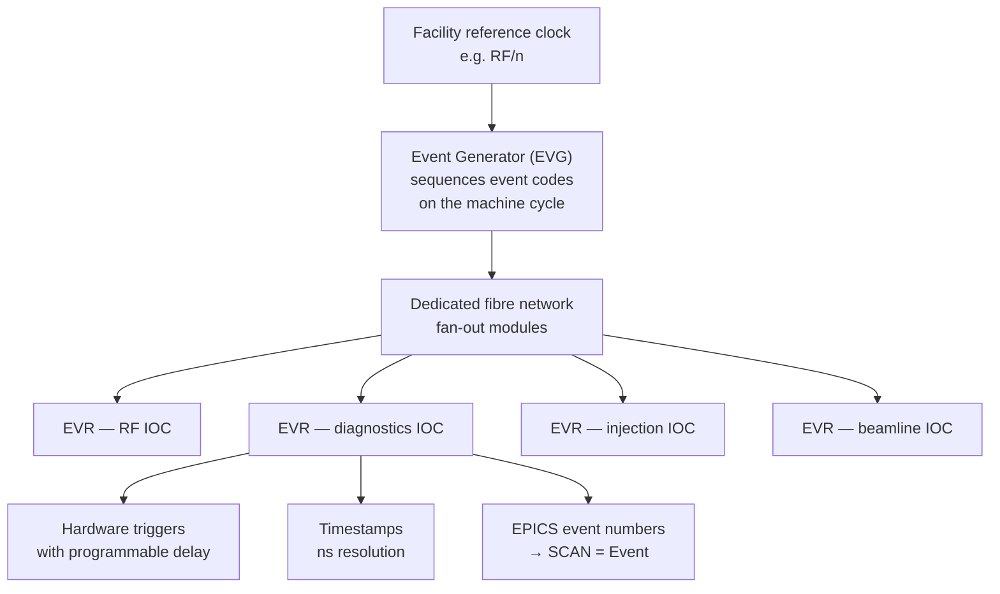

# Timing Systems

Timestamps in EPICS come from the IOC that produced the value. If your IOCs disagree about the time, your archive is a work of fiction and cross-subsystem correlation is impossible. This page is about making them agree — and about making things *happen* together, which is a harder problem.

## Two different problems

| Problem | Requirement | Solution |
| --- | --- | --- |
| **Timestamp correlation** — did the BPM spike before or after the RF trip? | Clocks agreeing to better than the phenomenon's timescale | NTP (ms), PTP (sub-µs), or an event system (ns) |
| **Synchronised action** — fire the kicker, gate the digitiser, and trigger the camera on the same beam pulse | Hardware distribution of triggers with deterministic delay | An event system. Software cannot do this. |

Software timestamping over Ethernet cannot solve the second problem, and only partially solves the first. That's why accelerators buy dedicated timing hardware.

## NTP: the baseline

Every IOC host must run NTP (or chrony) against a facility time source. This costs nothing and is non-negotiable.

- Typical accuracy on a LAN: **1–10 ms**. Adequate for slow signals, archiving of process values, and log correlation.
- Not adequate for: pulse-to-pulse correlation, fast diagnostics, or anything where you need to know the *order* of two events milliseconds apart.

The most common EPICS archive pathology is not a missing PV — it's a subsystem whose IOC host has drifted, producing data that looks plausible and correlates wrongly. Alarm on NTP offset via [iocStats](soft-support-modules.md#iocstats--deviocstats) or your host monitoring, and treat a drift alarm as a data-integrity incident.

## PTP: IEEE 1588

Precision Time Protocol achieves sub-microsecond synchronisation over Ethernet, given switches that support it (hardware timestamping, transparent or boundary clocks).

Good for: distributed digitisers, camera timestamping, anything needing microsecond-level correlation without a dedicated timing network. Increasingly common as switch support has become standard, and much cheaper than an event system. It gives you *time*, not *triggers* — a distinction that matters when you actually need to fire something.

## Event systems

The accelerator answer. A dedicated fibre network distributing a global clock plus **event codes**, with hardware receivers producing triggers and timestamps.

What an event receiver gives an IOC:

1. **Hardware triggers** with programmable delay and width, wired to digitisers, kickers, cameras, gates.
2. **A synchronised clock** — every EVR agrees to nanoseconds, so `TSE` on a record yields a timestamp derived from the timing system rather than the host clock.
3. **EPICS events** — an event code posts an EPICS event number, so records with `SCAN = Event` process on the beam pulse. This is how "acquire on every shot" is expressed in a database.
4. **A pulse identifier**, letting every IOC tag its data with *which shot* it came from. For pulsed machines this is more useful than a timestamp: data from twelve IOCs can be joined on the pulse ID with no clock arithmetic at all.

### mrfioc2

The EPICS driver for **Micro-Research Finland** timing hardware — the de facto standard event system in the accelerator community (SLS, ESS, NSLS-II, Diamond, SLAC and many others).

| | |
| --- | --- |
| Source | [github.com/epics-modules/mrfioc2](https://github.com/epics-modules/mrfioc2) |
| Hardware | [Micro-Research Finland](http://www.mrf.fi/) — EVG, EVR, fan-outs, in VME, PCIe, MTCA and cPCI form factors |

Provides EVG sequencing, EVR trigger and delay configuration, timestamp integration with EPICS records, event-code-to-EPICS-event mapping, and diagnostics for link health and event counts.

### Other event and trigger systems

| System | Where |
| --- | --- |
| **SLAC timing system** (LCLS/LCLS-II) | SLAC's own event system with beam-synchronous acquisition (BSA) layered on it |
| **White Rabbit** | CERN-originated, PTP-based sub-nanosecond synchronisation with deterministic data delivery; used at CERN, GSI, and increasingly elsewhere |
| **Delay generators** (Stanford DG645, Quantum Composers, BNC) | Small-scale trigger distribution for a beamline or test stand. Serial control, [StreamDevice](plc-and-fieldbus.md#streamdevice). Perfectly adequate when you need four triggers, not four hundred. |
| **PandABlocks** | Diamond/SOLEIL FPGA platform for triggering, position capture and continuous scanning; strong EPICS integration |

## Timestamps in the record layer

Where a record's `TIME` field comes from is controlled by `TSE`:

| `TSE` value | Meaning |
| --- | --- |
| `0` | The IOC's system clock, read when the record processes. The default. |
| `-1` | Device support supplies the timestamp — this is how a hardware-timestamped value keeps its true time |
| `-2` | Taken from the `TSEL` link's target — copy another record's timestamp |
| `>0` | A time-event number from the timing system, so the timestamp is the *event's* time, not the processing time |

That distinction is subtle and important. A digitiser IOC that reads a buffer 3 ms after the trigger should timestamp the data with the *trigger's* time, not the read's. `TSE = -1` with driver support, or `TSE = <event>`, gets you that. Default `TSE = 0` gets you the time your software got round to it — which for slow process values is fine and for fast diagnostics is wrong in a way that silently corrupts every correlation you later attempt.

## Beam-synchronous acquisition

For pulsed machines the useful question isn't "what was the value at 14:03:21.442" but "what were all these values on shot 918273". Facilities build acquisition layers on the event system to answer it: each IOC tags its data with the pulse ID from its EVR, and a service assembles per-shot records across IOCs.

SLAC's BSA is the best-known implementation; several other facilities have equivalents. If you work at a pulsed facility, this will be one of the first pieces of local infrastructure you meet, and it has no generic community equivalent — it's inherently facility-specific.

For a storage ring in top-up mode the problem is milder: the beam is continuous, so time-based correlation with PTP or NTP plus sensible `TSE` handling usually suffices, and the event system's main jobs are injection timing, [fast orbit feedback](../example-facility/subsystems.md) synchronisation, and gating diagnostics.

## Practical guidance

**NTP everywhere, alarmed.** The cheapest correctness win available.

**Decide your timestamp requirement explicitly.** "Milliseconds is fine" is a legitimate, defensible answer for vacuum and temperature. "We need to correlate to the pulse" costs a timing system. Deciding by default means discovering the requirement during a failure investigation.

**Get `TSE` right in fast diagnostics from day one.** Retrofitting timestamp semantics after two years of archived data means two years of data with subtly wrong times, and no way to fix it.

**Monitor the timing system itself.** Link status, event counts, and frame errors as PVs, alarmed. A degrading fibre produces intermittent, inexplicable acquisition faults — the kind that get blamed on three other subsystems first.

**Beware summer time and leap seconds.** EPICS timestamps are seconds since the EPICS epoch (1990-01-01 00:00:00 UTC) — UTC-based, unaffected by local time. Displays and log files are where local-time confusion enters. Run facility infrastructure in UTC and convert only at the point of display; the alternative is an ambiguous hour of archive data once a year.

## Next

→ [Client Libraries](client-libraries.md)
