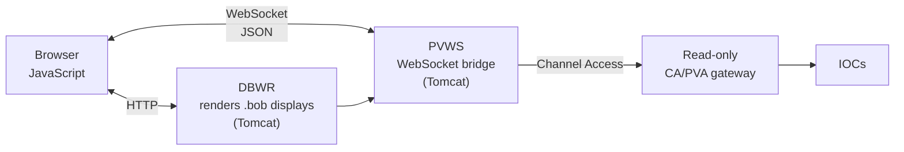

# Web Interfaces

Getting PVs into a browser. The motivation is always the same: people want to check the machine from a phone, a meeting room, or home, without installing a Java application or having write access.

## The architecture

Browsers cannot speak Channel Access — no raw UDP, no arbitrary TCP. So every web solution is a **bridge**: a server-side process that holds CA/PVA connections and re-exposes them over HTTP or WebSocket.



Two consequences that shape every deployment:

**The bridge is a fan-in point.** One PVWS instance holds one CA connection per PV and serves many browsers, which is good for IOC load and makes the bridge a capacity consideration of its own.

**The bridge is your security boundary.** Everything a browser can reach, the bridge can reach. Put the bridge in a DMZ, behind a **read-only** [gateway](gateways.md), and never in the controls network with write access. See [Networking](../architecture/networking.md).

## PVWS (PV Web Socket)

| | |
| --- | --- |
| Source | [github.com/ornl-epics/pvws](https://github.com/ornl-epics/pvws) |
| Origin | ORNL |
| Deployment | WAR file in [Tomcat](../build-install/tomcat.md) |
| This guide | [Install PVWS](../build-install/pvws.md) |

The foundation layer. Opens a WebSocket, subscribe to PV names, receive JSON messages with value, timestamp, severity and metadata. Speaks both CA and PVA on the back end.

```javascript
const ws = new WebSocket("wss://pvws.example.org/pvws/pv");
ws.onopen = () => ws.send(JSON.stringify({
    type: "subscribe",
    pvs: ["SR-CF-DI-DCCT-01:Current-Mon", "SR-CF-RF-CAV-01:Volt-Mon"]
}));
ws.onmessage = (e) => {
    const m = JSON.parse(e.data);
    console.log(m.pv, m.value, m.severity);
};
```

Build your own dashboards on this: a status page for the lobby, a custom mobile view, a Grafana-adjacent display, an embedded widget in a facility portal. It ships a demo page, and it's the back end for both DBWR and PV Info.

## DBWR (Display Builder Web Runtime)

| | |
| --- | --- |
| Source | [github.com/ornl-epics/dbwr](https://github.com/ornl-epics/dbwr) |
| Origin | ORNL (Kay Kasemir) |
| Deployment | WAR file in Tomcat; needs PVWS |
| Training | [Display Web Runtime](https://controlssoftware.sns.ornl.gov/training/2022_USPAS/Presentations/06%20Display%20Web%20Runtime.pdf) |
| This guide | [Install DBWR](../build-install/dbwr.md) |

**Renders your existing Phoebus Display Builder files in a browser.** Point it at a `.bob` file and it serves an interactive web version — no client install, works on phones and tablets, supports most widgets and their key features.

This is the highest-value item on this page, because of what it *doesn't* require: no separate web UI to design, no second set of screens to maintain, no divergence between what the control room sees and what the on-call engineer sees on their phone. One display file, two runtimes.

Limitations are honest and documented: not every widget and not every property is supported, and complex scripted displays may not translate. Test the specific screens you care about.

## PV Info

| | |
| --- | --- |
| Source | [github.com/ChannelFinder/pvinfo](https://github.com/ChannelFinder/pvinfo) |

A web front end to [ChannelFinder](directory-services.md): search PVs by wildcard name, or by metadata — IOC name, record type, host, any registered property. Then, for a given PV, it links out to the other services: archived history, alarm configuration, save-set membership, the owning IOC's status.

That cross-linking is the real value. "What is this PV, who serves it, what does its history look like, and is it alarmed?" is a question asked dozens of times a day at a facility, and PV Info answers it in one page instead of five tools.

## Grafana

Not EPICS-specific, and probably the most widely deployed web interface in the ecosystem anyway.

- **[Archiver Appliance data source](https://github.com/sasaki77/archiverappliance-datasource)** — query archived PV history directly. Grafana's plugin catalogue lists it as *Archiver Appliance*.
- **Prometheus/InfluxDB paths** — export selected PVs into a time-series database and treat them like any other metric.

Use it for: shift dashboards, long-term trends, correlating control-system data with IT infrastructure metrics, and anything a manager wants on a wall display. Grafana's alerting is *not* a substitute for the [EPICS alarm system](alarms.md) — it has no severity model, no acknowledgement workflow, and no relationship to the record fields that define what "abnormal" means.

See [Observability](observability.md) for the infrastructure-monitoring side.

## Service web UIs

Several services ship their own web front ends, which are often the easiest way to use them:

| Service | Web UI |
| --- | --- |
| [Archiver Appliance](archiving.md#epics-archiver-appliance) | Full management and retrieval UI: add PVs, check archiving status, plot, export |
| [Olog](logbooks.md#olog) | Web logbook client |
| [ChannelFinder](directory-services.md) | REST API plus PV Info as the human interface |
| [Save & restore](save-and-restore.md) | REST API; Phoebus provides the UI |
| [Alarm logger](alarms.md#alarm-logger) | Alarm history via Elasticsearch, typically surfaced in Grafana or Kibana |

## Guidance

**Read-only by default, and mean it.** The bridge sits behind a read-only [gateway](gateways.md) so that "read-only" is a topological fact rather than a configuration setting someone can change. If you genuinely need web write access — some facilities do, for specific beamline operations — that is an authenticated, audited, separately-deployed path, not a flag on the read-only one.

**Authenticate at the reverse proxy.** Put nginx or Apache in front with SSO/OIDC. PVWS and DBWR are not identity systems and shouldn't be asked to be.

**HTTPS/WSS, always.** Especially since these are the components most likely to be exposed beyond the controls network.

**Watch the bridge's PV count.** One bridge holding tens of thousands of channels for a handful of dashboards is a common accident — usually a page subscribing to everything and displaying a fraction.

**Don't rebuild the control room in a browser.** Web access is for status, monitoring, and remote awareness. The primary operator interface should be [Phoebus or PyDM](operator-interfaces.md) on a machine in the control room, on the controls network, with the latency and reliability characteristics that implies.

## Next

→ [Archiving](archiving.md)
